# Test Case 001 — Solo Full Workflow

**Date:** 2026-03-19  
**Status:** ✅ Pass  
**Browser:** chromium

---

## Step 1: Load the application

The landing screen is displayed with "Create Room" and "Join Room" options. No account or login is required.

**Status:** ✅ Success

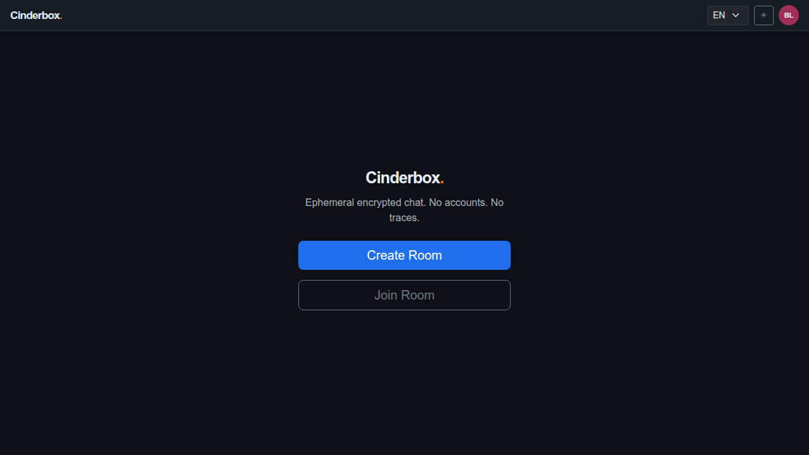

---

## Step 2: Click the "Create Room" button

The room creation form is shown. The user provides a password used to derive the encryption key client-side. The password never leaves the device.

**Status:** ✅ Success

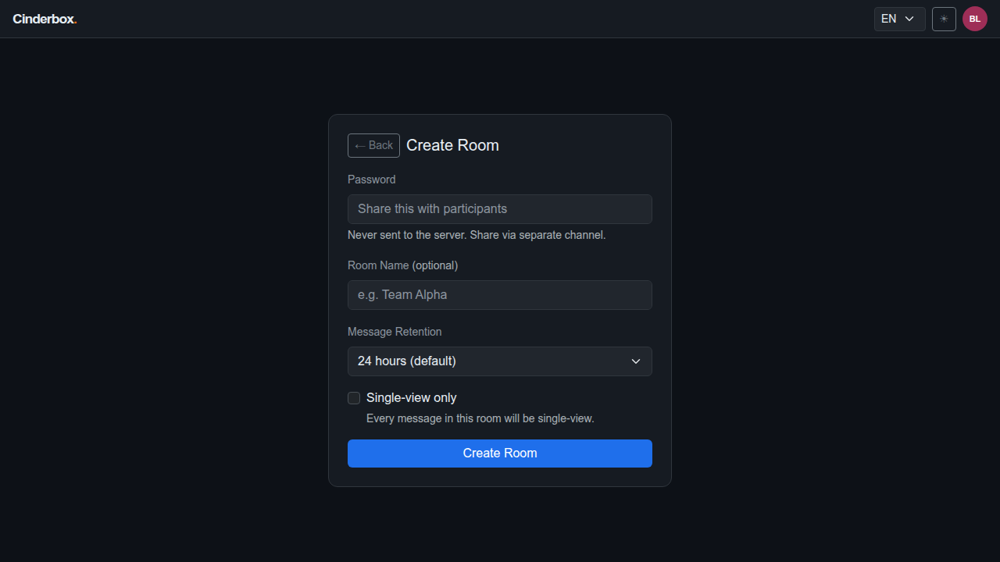

---

## Step 3: Enter a room password and create the room

After submitting, the room is created on the server. The client derives the AES-256-GCM encryption key via PBKDF2 (200k iterations, SHA-256). The chat interface opens immediately.

**Status:** ✅ Success

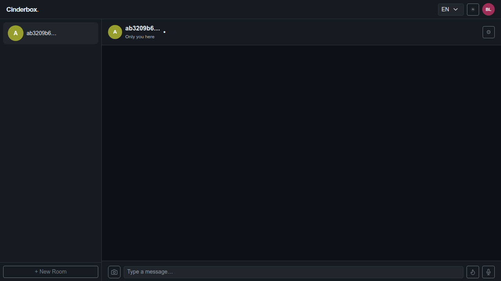

---

## Step 4: Type a message and send it

A text message is typed and sent by pressing Enter. The message is encrypted client-side before transmission and appears in the chat thread with a pending delivery tick.

**Status:** ✅ Success

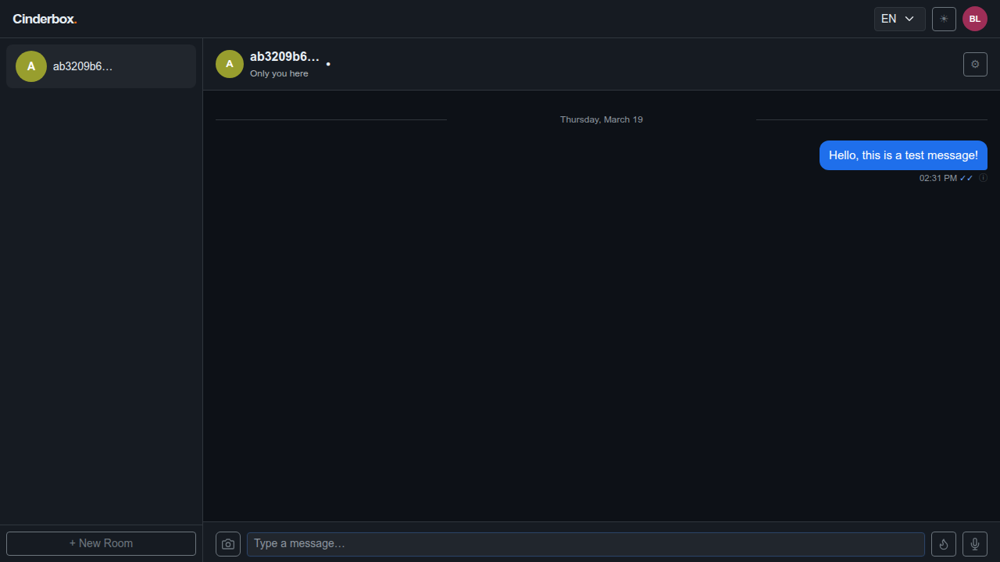

---

## Step 5: Attach an image and type a caption

An image is selected via the attachment button. The app compresses it client-side (resized to 1000px, encoded as AVIF → WebP → JPEG) and shows a preview with an optional caption field.

**Status:** ✅ Success

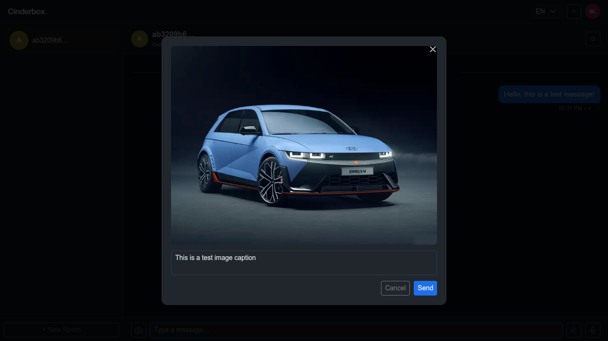

---

## Step 6: Send the image

The image is sent. The compressed blob is base64-encoded and embedded in the encrypted payload. The preview overlay closes and the image appears in the chat thread.

**Status:** ✅ Success

---

## Step 7: Open the Profile screen from the navigation menu

The profile screen is accessible from the avatar button in the top-right corner. All profile data is stored locally — no account is created on the server.

**Status:** ✅ Success

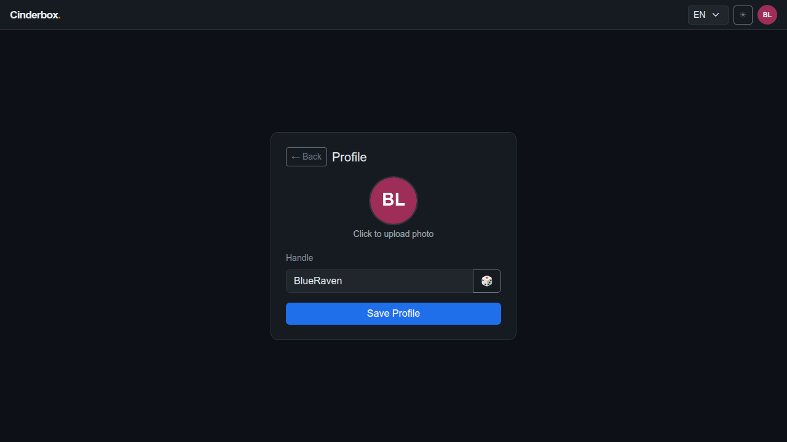

---

## Step 8: Generate a random handle with the dice button

The dice button generates a random human-readable handle. Handles are arbitrary — they identify the user within a room but carry no persistent account information.

**Status:** ✅ Success

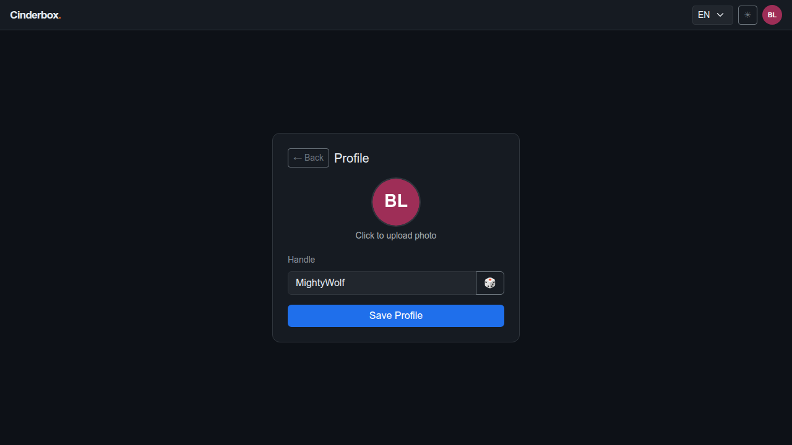

---

## Step 9: Save the profile

Saving the profile stores the handle and avatar in localStorage and broadcasts a profile_update message to all room participants. The app returns to the chat screen.

**Status:** ✅ Success

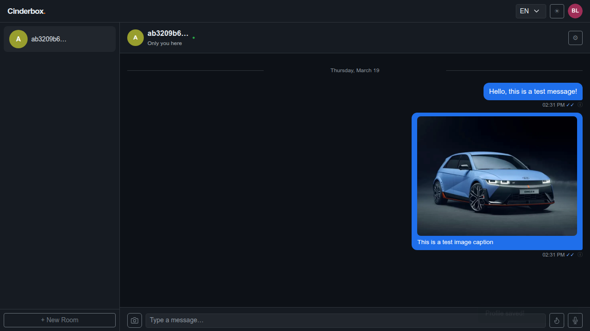

---

## Step 10: Toggle the UI theme

The theme toggles between dark and light mode. The preference is persisted in localStorage and applied immediately without a page reload.

**Status:** ✅ Success

---

## Step 11: Change the interface language to Portuguese (pt-BR)

The interface switches to Brazilian Portuguese. All strings are translated client-side from an embedded dictionary. The preference is persisted in localStorage.

**Status:** ✅ Success

---

## Step 12: Change the interface language back to English

The interface switches back to English. Language selection is independent of other settings and takes effect immediately.

**Status:** ✅ Success

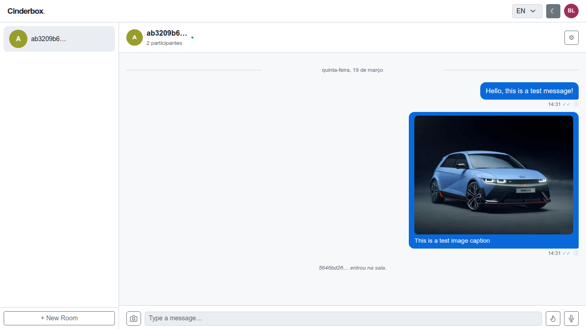

---

## Step 13: Open the room settings panel

The room settings panel slides in from the right. It shows the room URL, participant list, message retention policy, and danger zone options (Leave Room / Delete Room).

**Status:** ✅ Success

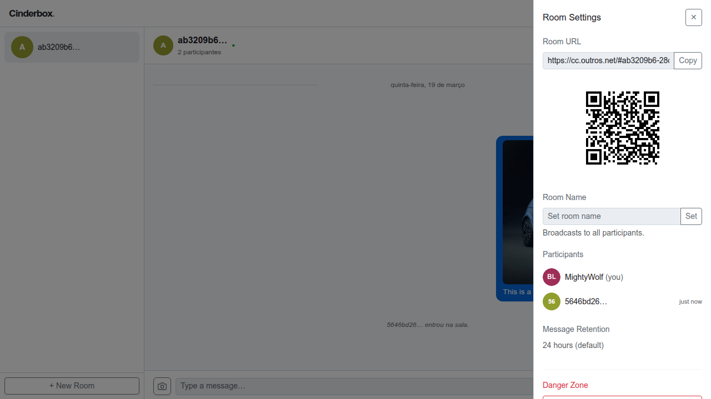

---

## Step 14: Set a room name

The room name is stored locally and broadcast as an encrypted room_name message to all participants. Room names are never stored on the server.

**Status:** ✅ Success

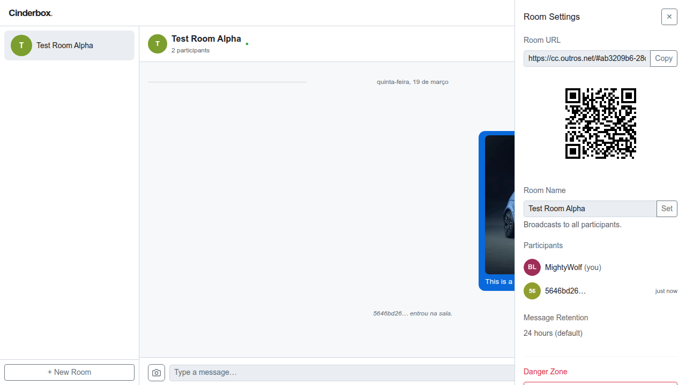

---

## Step 15: Reopen the settings panel to confirm the room name

After the room name is set, the topbar shows the custom name. Reopening the settings panel confirms the name is persisted in localStorage.

**Status:** ✅ Success

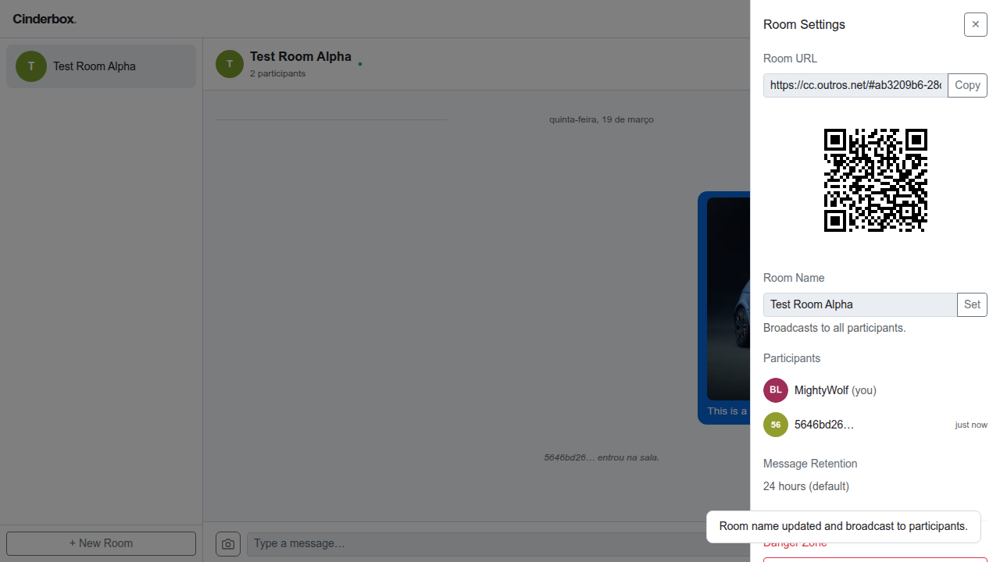

---

## Step 16: Click the "Delete Room" button

The Delete Room button sends a deletion request to the server using the owner's delete token. A native confirmation dialog is presented before the action is executed.

**Status:** ✅ Success

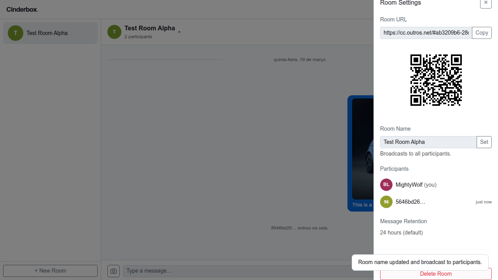

---

## Step 17: Room deleted — app returns to the landing screen

After confirming deletion, the room and all its messages are permanently removed from the server. Since no other rooms exist, the app returns to the landing screen.

**Status:** ✅ Success

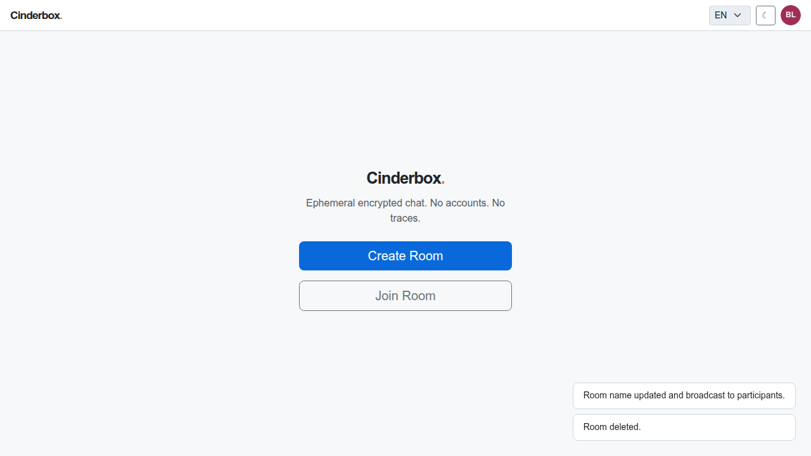

---
