# Test Case 002 — Two Participants Workflow

**Date:** 2026-03-19  
**Status:** ✅ Pass  
**Browser:** chromium

---

## Step 1: [User A] Load the application

User A opens the app and sees the landing screen. No account or login is required. Each browser context has its own isolated localStorage and IndexedDB.

**Status:** ✅ Success

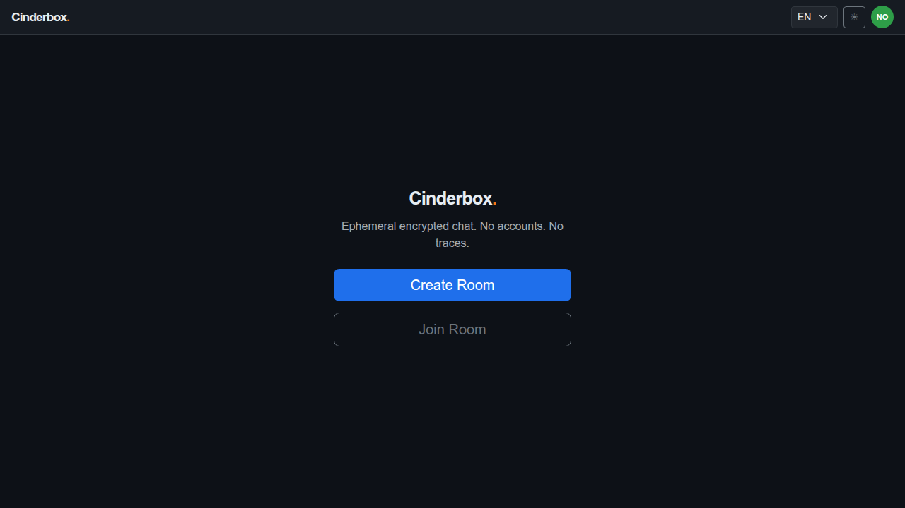

---

## Step 2: [User A] Create a room

User A creates a room with a shared password. The room ID is appended to the URL as a hash fragment. User A's client derives the AES-256-GCM key via PBKDF2 (200k iterations, SHA-256). The chat screen opens.

**Status:** ✅ Success

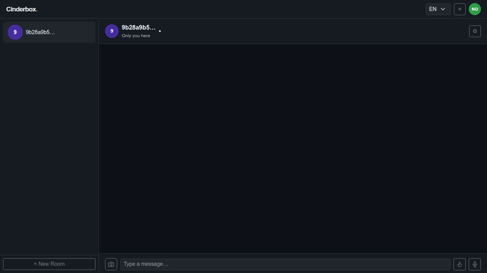

---

## Step 3: [User B] Navigate to the room URL and toggle the theme

User B opens the same URL shared by User A. The join screen is displayed with the room ID pre-filled. User B toggles the UI theme — demonstrating that theme preference is independent of room state and takes effect immediately.

**Status:** ✅ Success

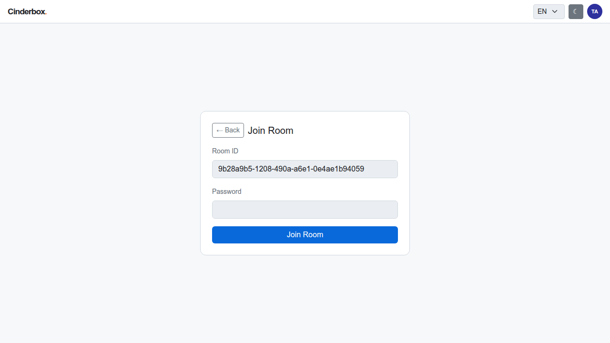

---

## Step 4: [User B] Enter the password and join the room

User B enters the shared password. The client derives the same key and validates it against the encryption_test value stored on the server. On success, the room is saved locally and the chat screen opens.

**Status:** ✅ Success

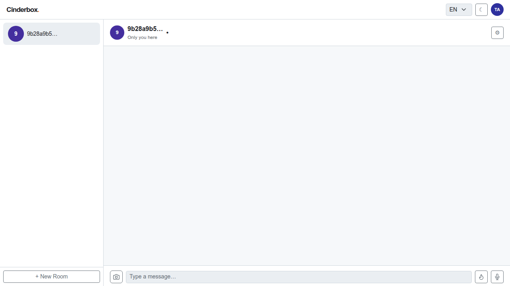

---

## Step 5: [User A] Observe the join notification

After a sync cycle, User A's client compares the server presence list against its known tags and detects User B as a new arrival. A system notice is generated locally — no join message is ever sent to the server.

**Status:** ✅ Success

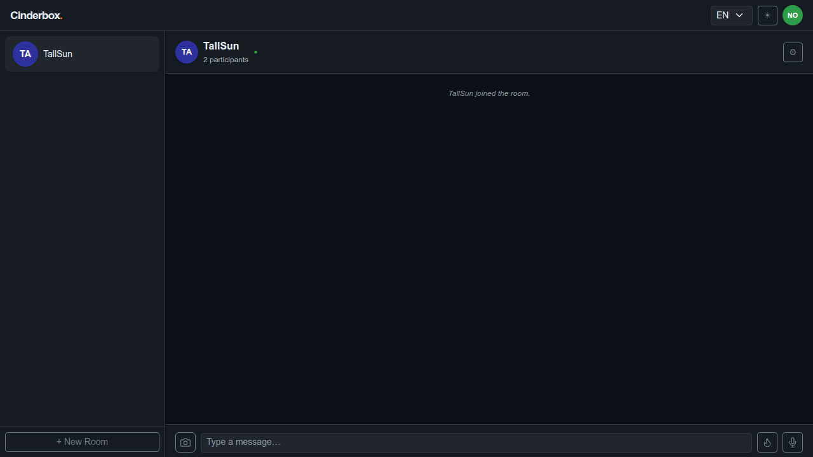

---

## Step 6: [User A] Send a text message

User A types and sends a message. It is encrypted client-side before transmission. The server stores only ciphertext. The message appears in User A's thread with a pending delivery tick.

**Status:** ✅ Success

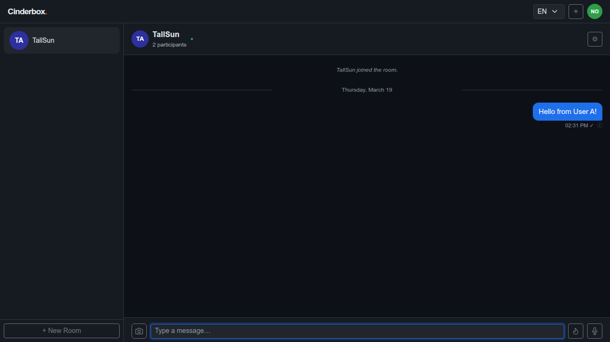

---

## Step 7: [User B] Receive and read the text message

After a sync cycle, User B's client fetches and decrypts the message. It appears in User B's chat thread. The server never had access to the plaintext content.

**Status:** ✅ Success

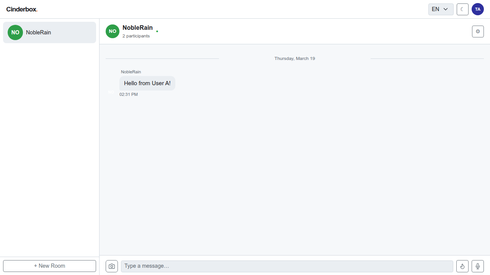

---

## Step 8: [User A] Send a single-view text message

User A activates single-view mode with the 💣 button and sends a message. Single-view messages are encrypted like any other — but the recipient's client wipes the content permanently after the first viewing.

**Status:** ✅ Success

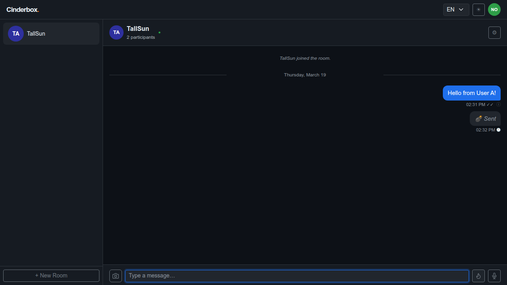

---

## Step 9: [User B] Receive and open the single-view message

User B's sync delivers the single-view message as a sealed bubble. Tapping it triggers a server sync to confirm receipt before decryption. The content is then shown in a full-screen modal overlay.

**Status:** ✅ Success

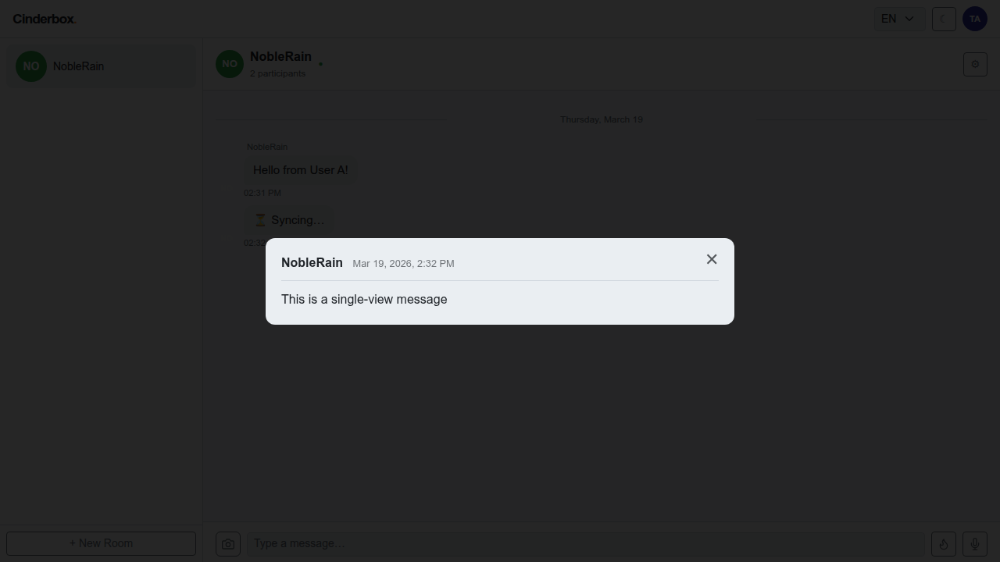

---

## Step 10: [User B] Close the single-view modal

User B closes the modal. The message content is immediately wiped from the device. An ack_single_view_deleted acknowledgement is queued and sent to User A on the next sync.

**Status:** ✅ Success

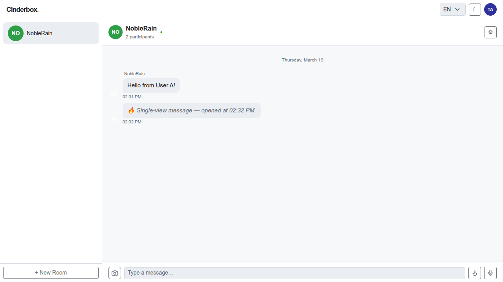

---

## Step 11: [User A] Confirm the single-view deletion acknowledgement

After a sync cycle, User A receives the ack_single_view_deleted acknowledgement. The delivery tick on the single-view message updates to confirm that User B has opened and wiped the content.

**Status:** ✅ Success

---

## Step 12: [User B] Send an image

User B selects an image from the device. The app compresses it client-side (resized to 1000px, encoded as AVIF → WebP → JPEG) and shows a preview overlay. After confirming, the encrypted image payload is sent to the server.

**Status:** ✅ Success

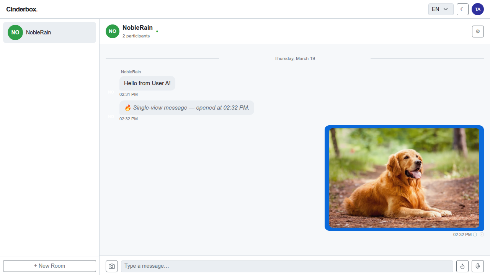

---

## Step 13: [User A] Receive the image from User B

After a sync cycle, User A's client fetches and decrypts the image message. The image is rendered inline in the chat thread. The server only ever stored the encrypted blob.

**Status:** ✅ Success

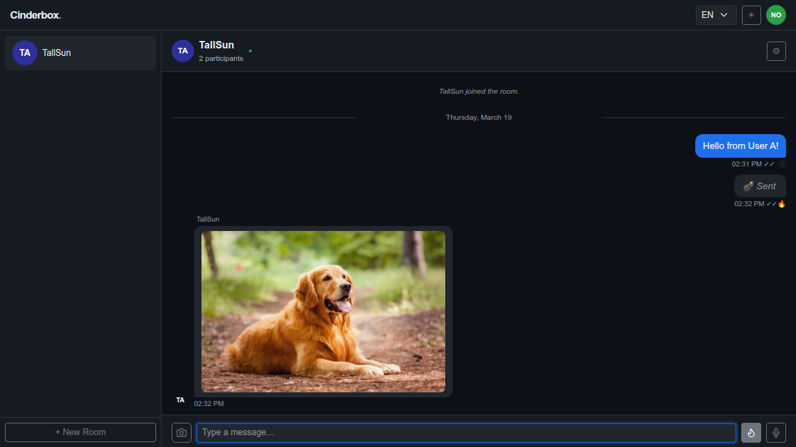

---

## Step 14: [User B] Leave the room

User B opens the settings panel and clicks Leave Room. A leave_room message is sent to the server before departure. User B is removed from the local room list and the app returns to the landing screen.

**Status:** ✅ Success

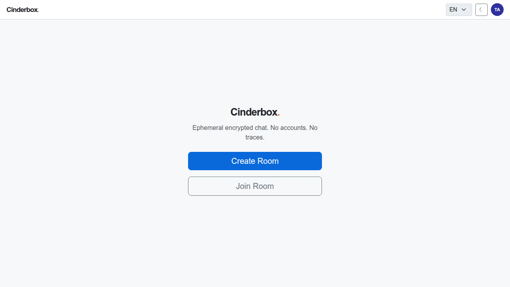

---

## Step 15: [User A] Observe the leave notification

After a sync cycle, User A's client processes the leave_room message and displays a system notice. User B is removed from the presence list. This is the last message sent before User B's departure.

**Status:** ✅ Success

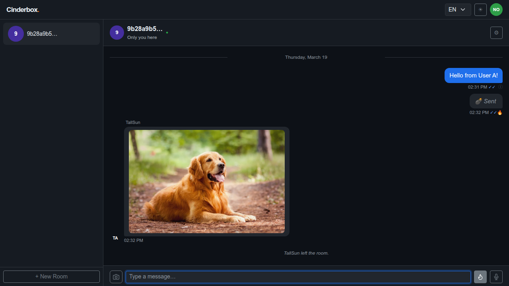

---

## Step 16: [User A] Delete the room

User A opens the settings panel and clicks Delete Room. A deletion request is sent using the owner's delete token (stored as a SHA-256 hash on the server). A confirmation dialog is presented before the action executes.

**Status:** ✅ Success

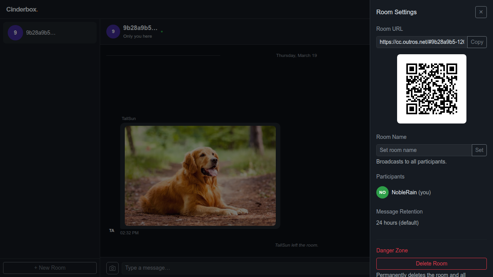

---

## Step 17: [User A] App returns to the landing screen

After confirming deletion, the room and all its messages are permanently removed from the server. User A's app returns to the landing screen. The full two-party session is complete.

**Status:** ✅ Success

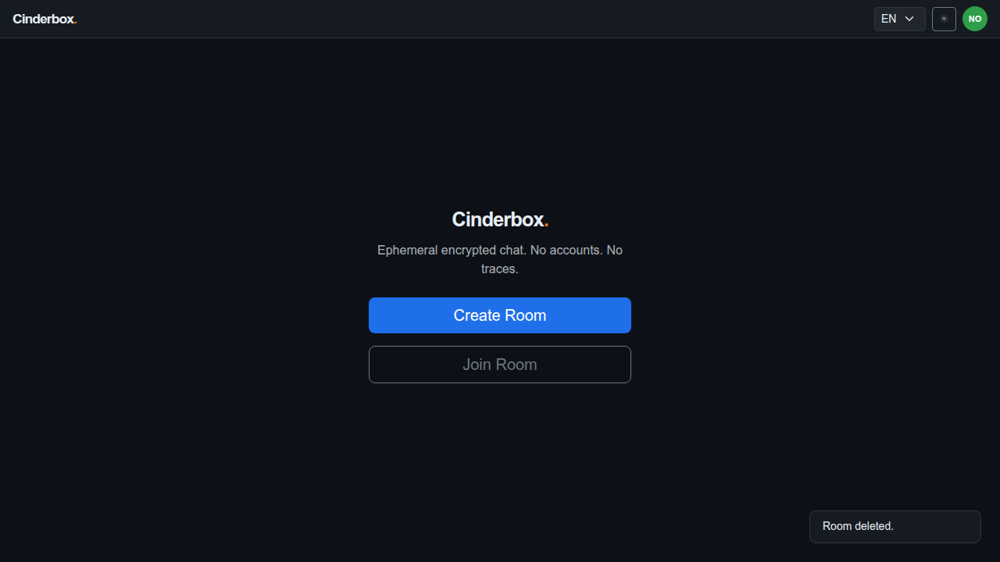

---

## Step 18: [User B] Confirm User B is on the landing screen

User B is already on the landing screen after leaving the room in step 14. Both participants have returned to the initial state, with no residual data stored on the server.

**Status:** ✅ Success

---
