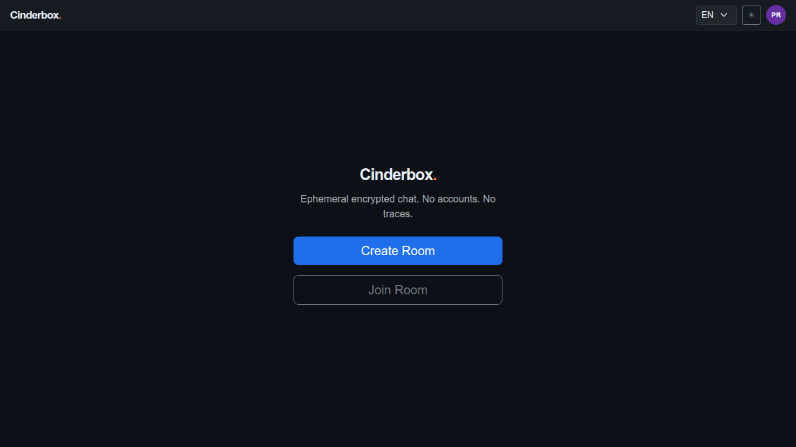
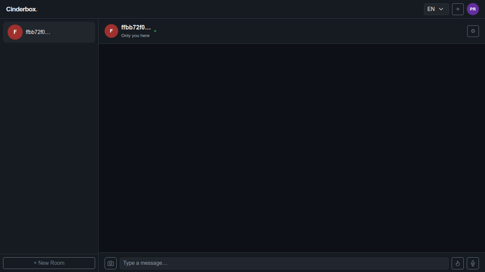
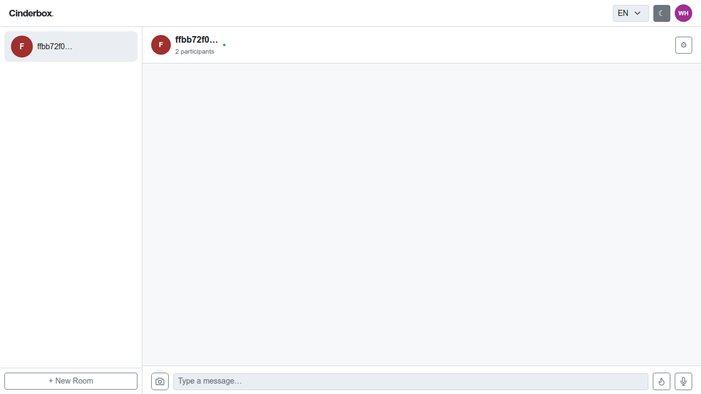
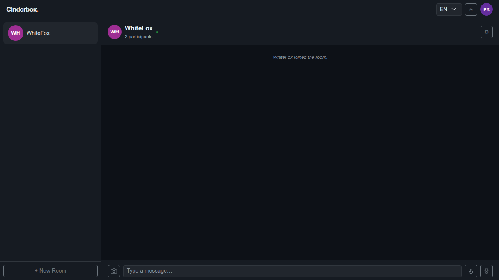
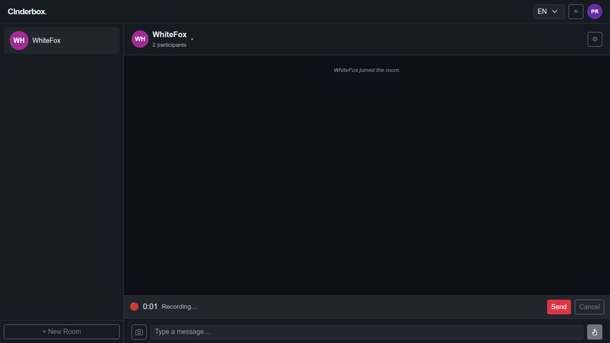
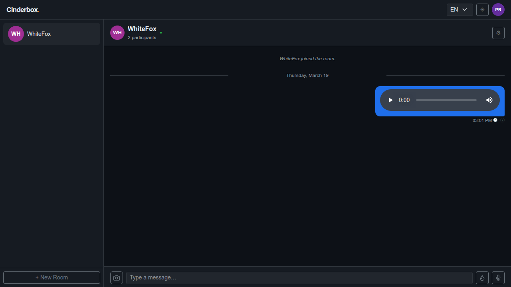
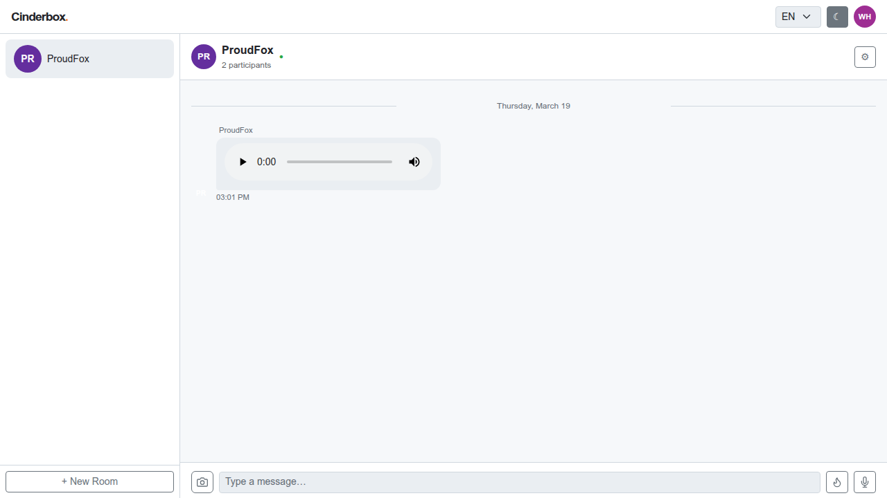
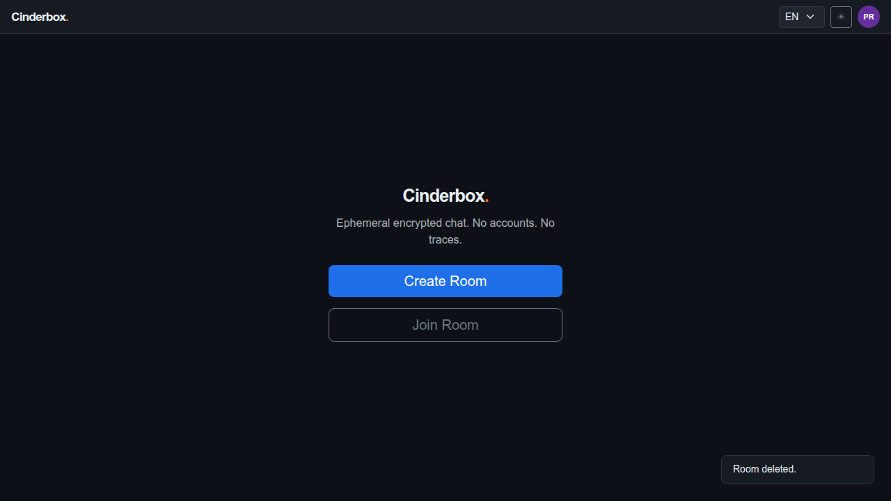
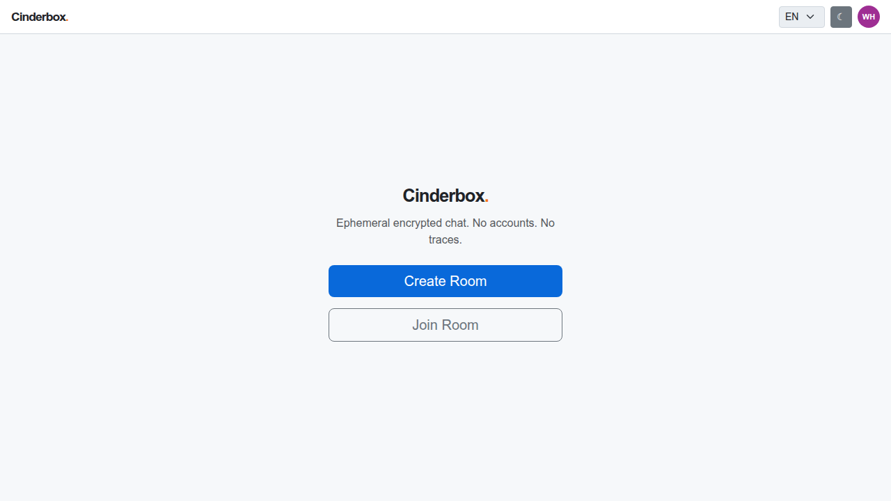

# Test Case 003 — Audio Message Workflow

**Date:** 2026-03-19  
**Status:** ✅ Pass  
**Browser:** chromium

---

## Step 1: [User A] Load the application

User A opens the app and sees the landing screen. The browser is launched with fake audio device flags so MediaRecorder can capture audio in a headless environment.

**Status:** ✅ Success

---

## Step 2: [User A] Create a room

User A creates a room. The room ID is embedded in the URL hash and shared with User B out-of-band.

**Status:** ✅ Success

---

## Step 3: [User B] Join the room and toggle the theme

User B joins the room with the shared password. The encryption key is derived and validated client-side. User B then toggles the UI theme, demonstrating that each participant's theme preference is stored independently in their own localStorage.

**Status:** ✅ Success

---

## Step 4: [User A] Observe the join notification

After a sync cycle, User A sees a system notice that User B has joined. Presence is detected client-side from the server presence list — no join message is transmitted.

**Status:** ✅ Success

---

## Step 5: [User A] Start recording an audio message

User A clicks the microphone button (visible when the message input is empty). The browser captures audio from the fake device. The recording bar appears with a live timer.

**Status:** ✅ Success

---

## Step 6: [User A] Stop recording and send the audio message

User A stops the recording after a few seconds. The audio blob is encoded as base64 and embedded in the encrypted payload before being sent to the server.

**Status:** ✅ Success

---

## Step 7: [User B] Receive the audio message

After a sync cycle, User B's client fetches and decrypts the audio message. An HTML audio player is rendered inline in the chat thread. The server only ever stored the encrypted blob.

**Status:** ✅ Success

---

## Step 8: [User A] Delete the room

User A deletes the room. The deletion request is authenticated with the owner's delete token. All messages are permanently removed from the server.

**Status:** ✅ Success

---

## Step 9: [User A] App returns to the landing screen

After deletion, User A's app returns to the landing screen.

**Status:** ✅ Success

---

## Step 10: [User B] Room deletion detected — device data purged

On the next sync cycle after deletion, the server returns not_found for the room. User B's client calls purgeRoomLocally(): all messages and outbox items are deleted from IndexedDB, the room is removed from localStorage, and the app navigates to the landing screen. No residual data remains on the device.

**Status:** ✅ Success

---
