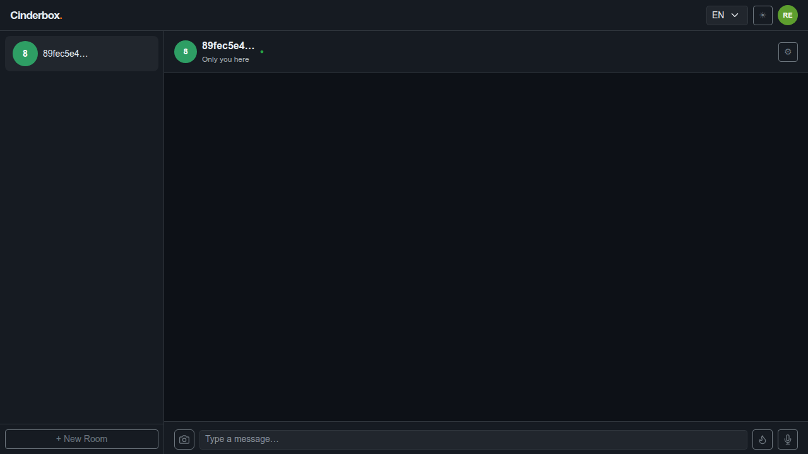
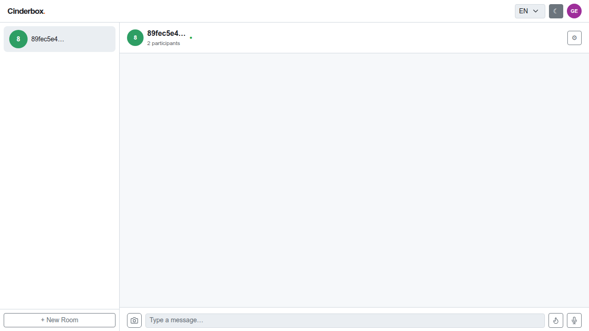
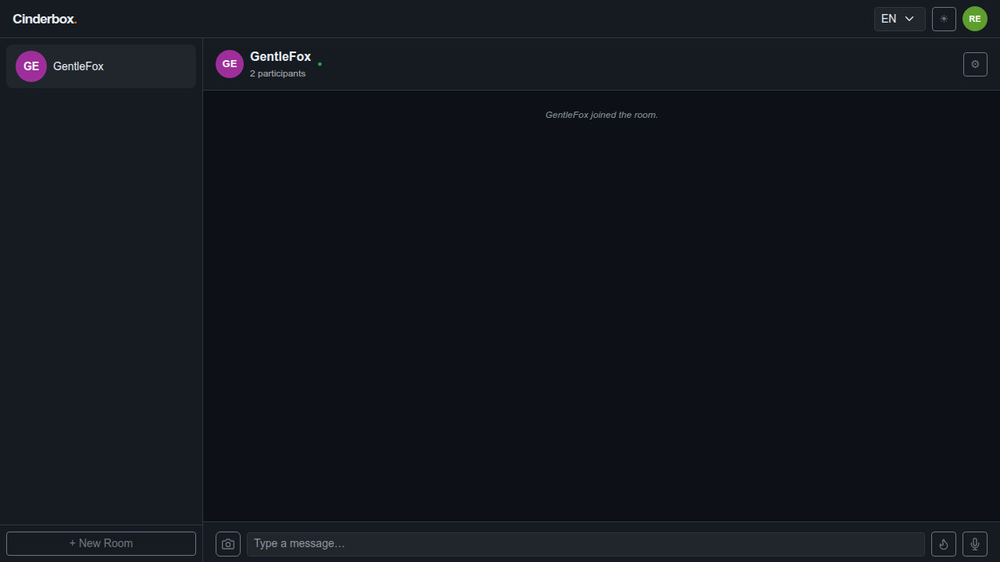
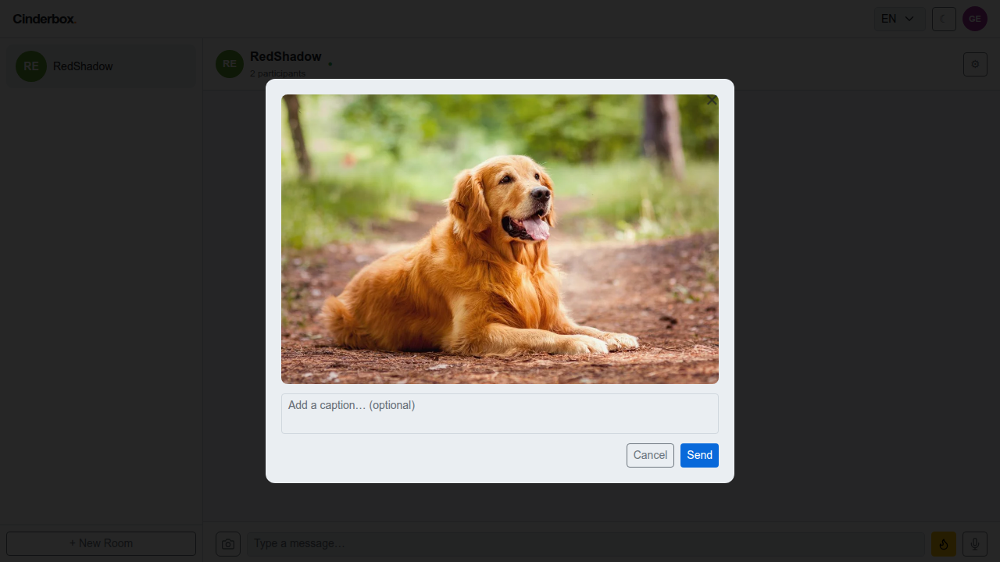
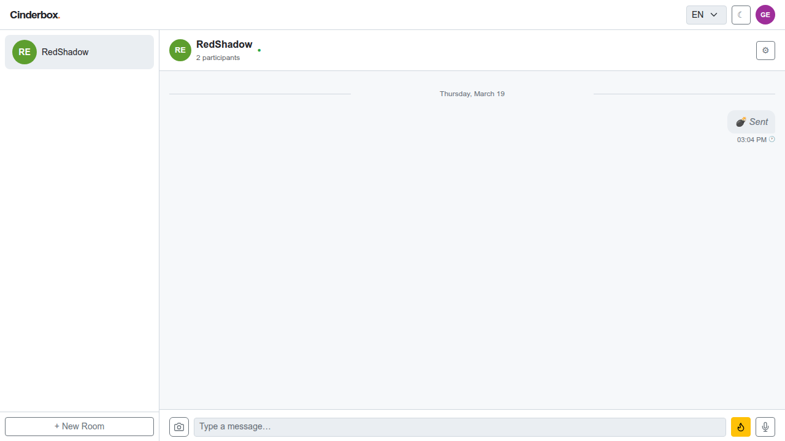
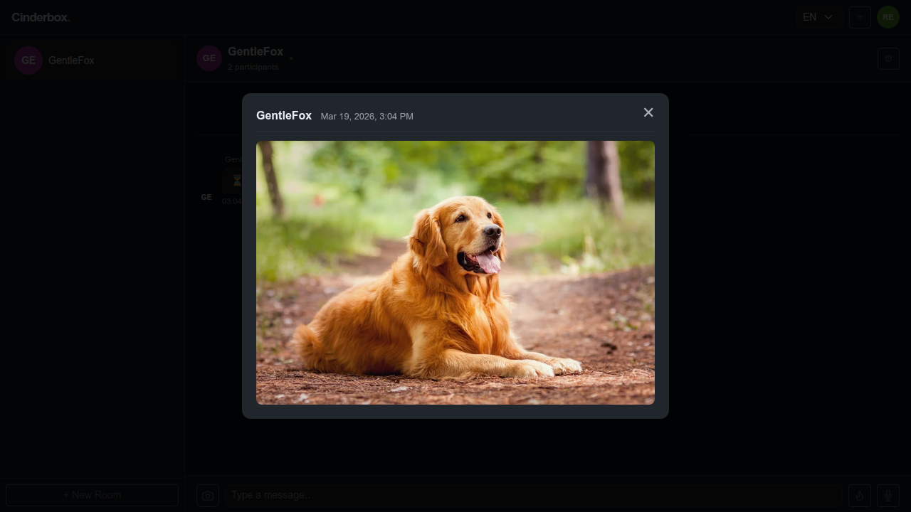
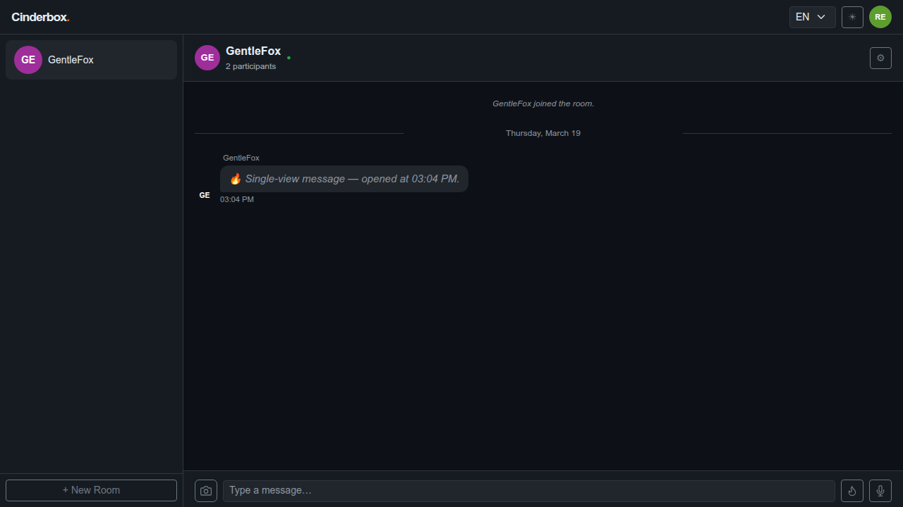
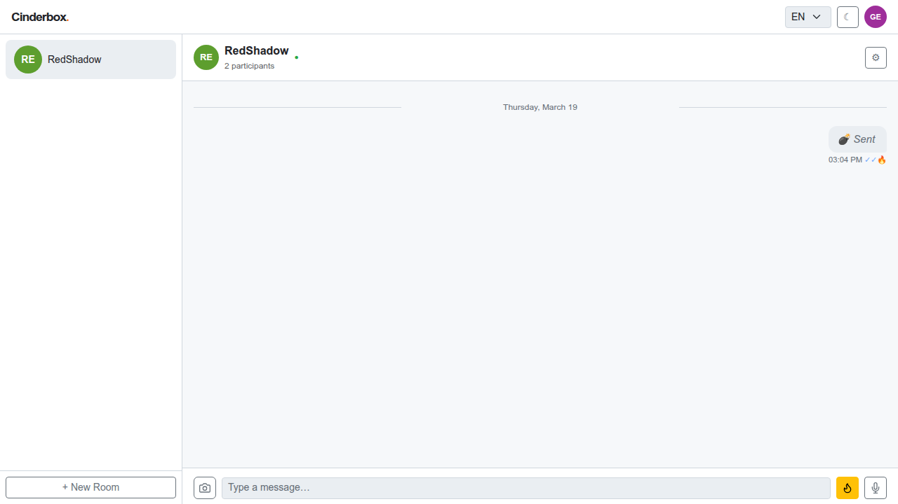
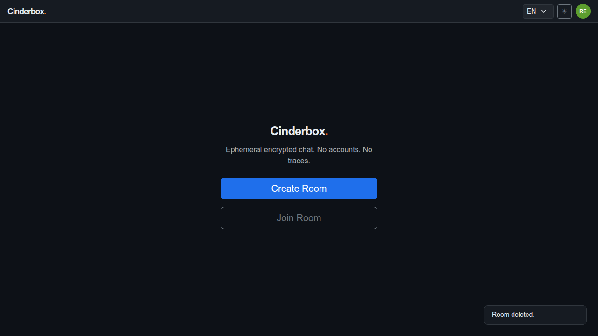
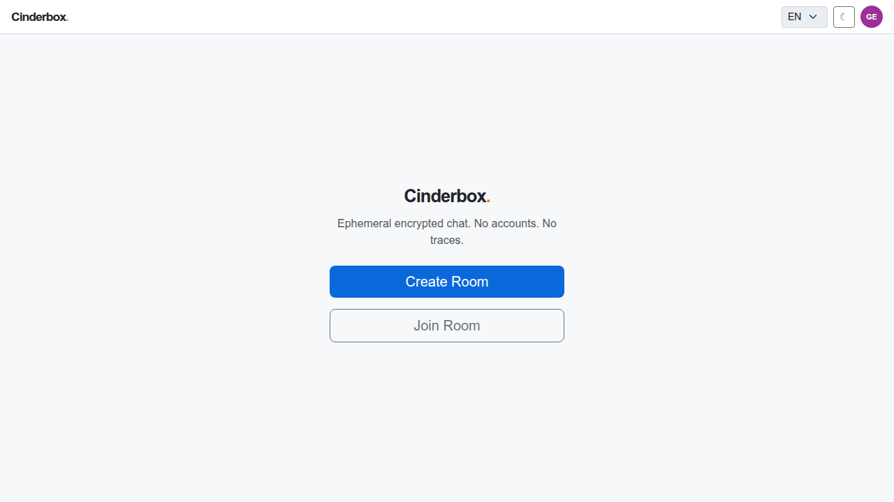

# Test Case 004 — Single-View Image Message

**Date:** 2026-03-19  
**Status:** ✅ Pass  
**Browser:** chromium

---

## Step 1: [User A] Load the application and create a room

User A creates a room and arrives at the chat screen. The room URL hash is ready to share with User B.

**Status:** ✅ Success

---

## Step 2: [User A] Copy the room URL

The room URL (with hash) is extracted so User B can navigate directly to the room.

**Status:** ✅ Success

---

## Step 3: [User B] Join the room and toggle the theme

User B joins the room with the shared password. The encryption key is derived and validated locally. User B then toggles the UI theme — each participant's preference is stored independently in their own localStorage and has no effect on the other participant's view.

**Status:** ✅ Success

---

## Step 4: [User A] Observe the join notification

User A detects User B's arrival from the presence list returned by the next sync. A system notice is generated locally.

**Status:** ✅ Success

---

## Step 5: [User B] Activate single-view mode and select an image

User B activates single-view mode with the 💣 button (it turns yellow), then selects an image. The app compresses the image client-side and shows a preview overlay. Because single-view mode is active, the image will be sent as a single_view message.

**Status:** ✅ Success

---

## Step 6: [User B] Send the single-view image

User B confirms the send. The compressed image blob is base64-encoded and embedded in the encrypted single_view payload. The preview overlay closes and a sealed bubble appears in User B's thread.

**Status:** ✅ Success

---

## Step 7: [User A] Receive and open the single-view image

After a sync cycle, User A sees a sealed single-view bubble. Tapping it triggers a server sync to confirm receipt before decryption. The image is shown in a modal overlay.

**Status:** ✅ Success

---

## Step 8: [User A] Close the single-view modal

User A closes the modal. The image content is immediately wiped from User A's device. An ack_single_view_deleted acknowledgement is sent to User B on the next sync.

**Status:** ✅ Success

---

## Step 9: [User B] Confirm the single-view deletion acknowledgement

After two sync cycles, User B receives the ack_single_view_deleted acknowledgement from User A. The delivery tick on the sent message updates to confirm the content has been viewed and wiped.

**Status:** ✅ Success

---

## Step 10: [User A] Delete the room

User A deletes the room. All messages — including the wiped single-view image — are permanently removed from the server.

**Status:** ✅ Success

---

## Step 11: [User A] App returns to the landing screen

The app returns to the landing screen.

**Status:** ✅ Success

---

## Step 12: [User B] Room deletion detected — device data purged

On the next sync cycle after deletion, the server returns not_found for the room. User B's client calls purgeRoomLocally(): all messages and outbox items are deleted from IndexedDB, the room is removed from localStorage, and the app navigates to the landing screen. No residual data remains on the device.

**Status:** ✅ Success

---
