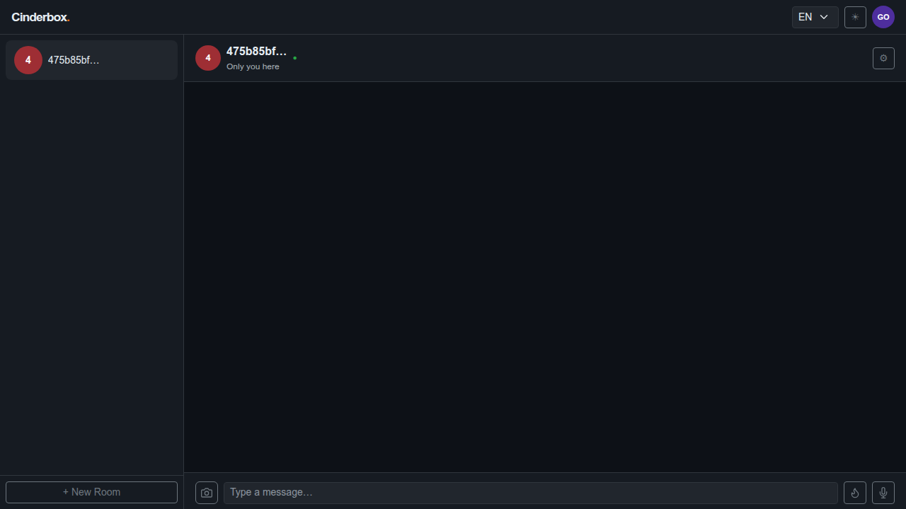
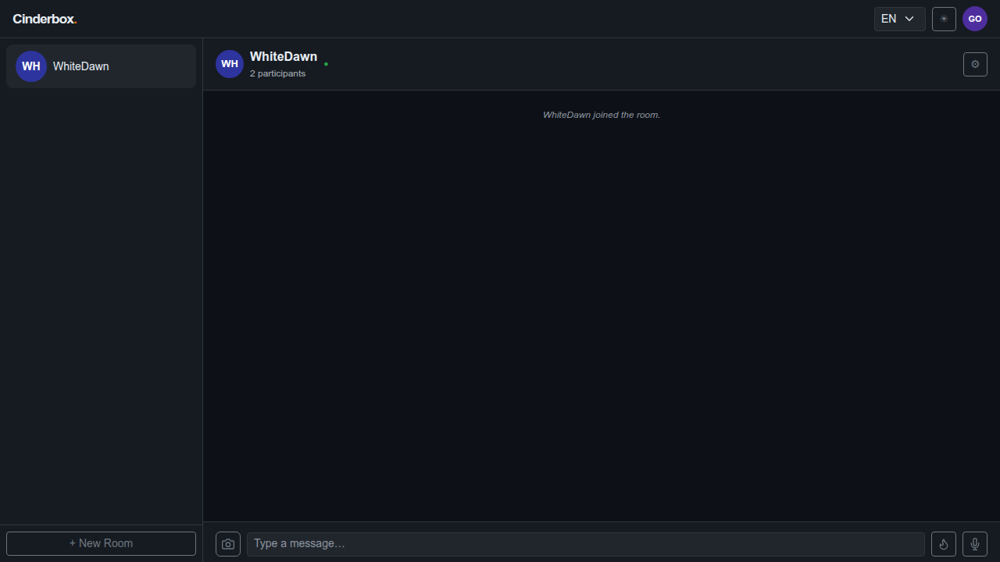
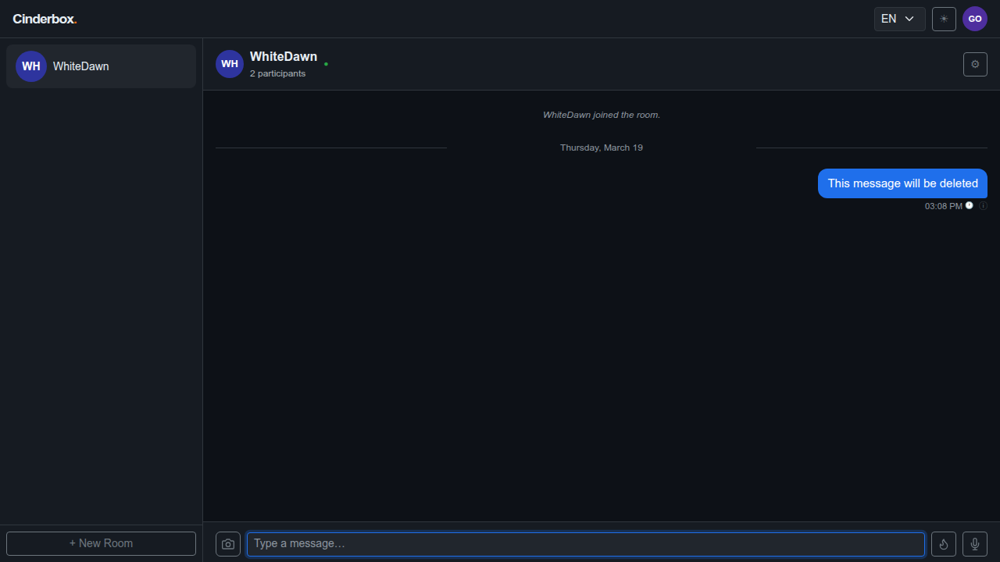
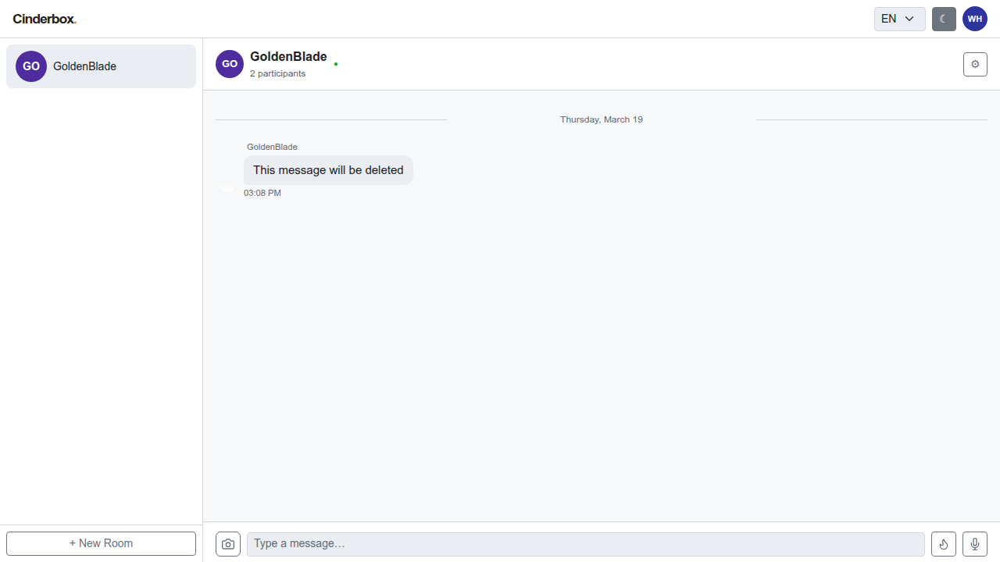
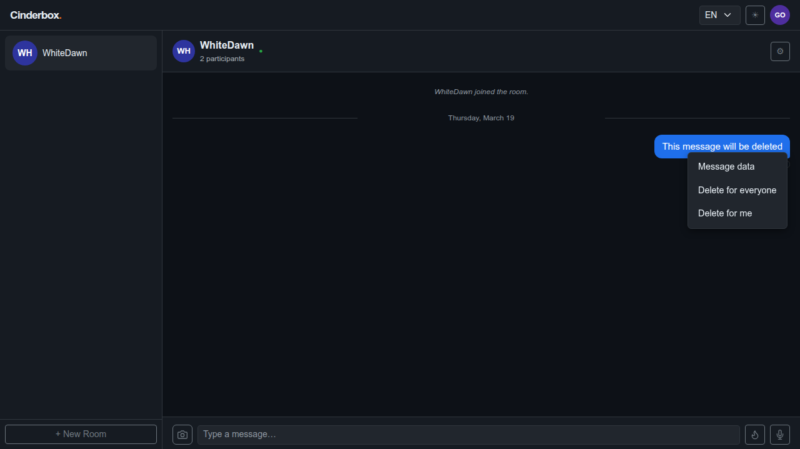
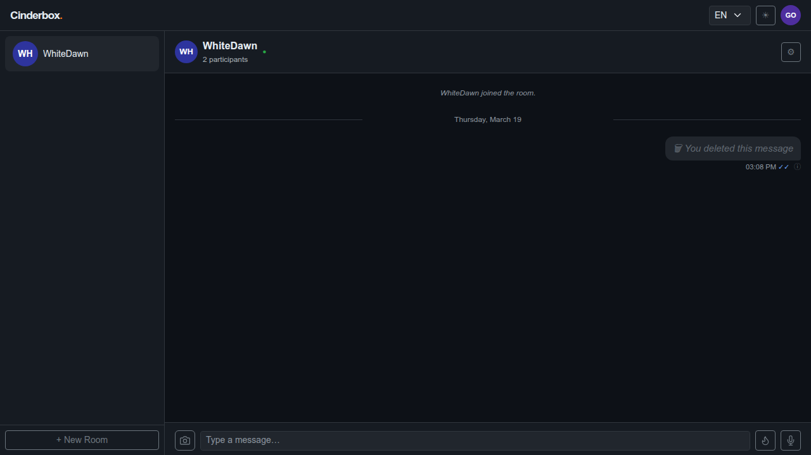
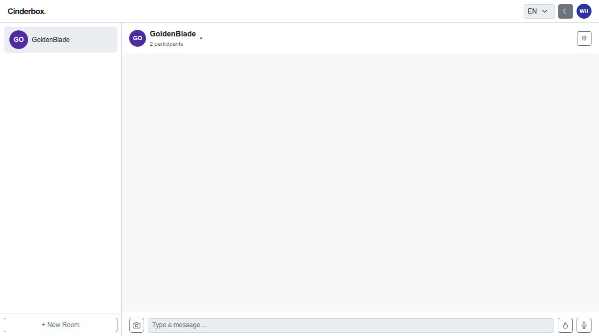
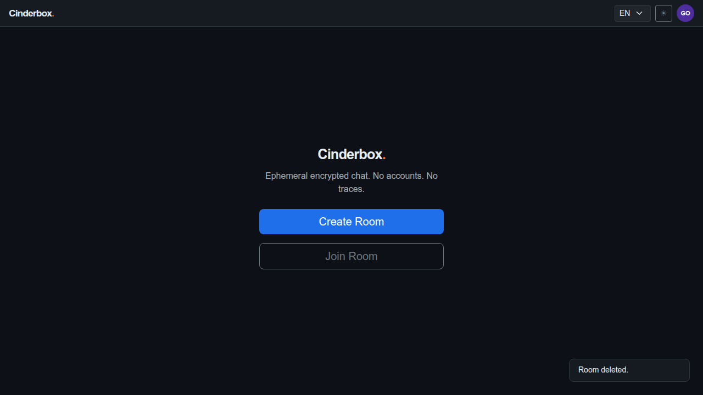
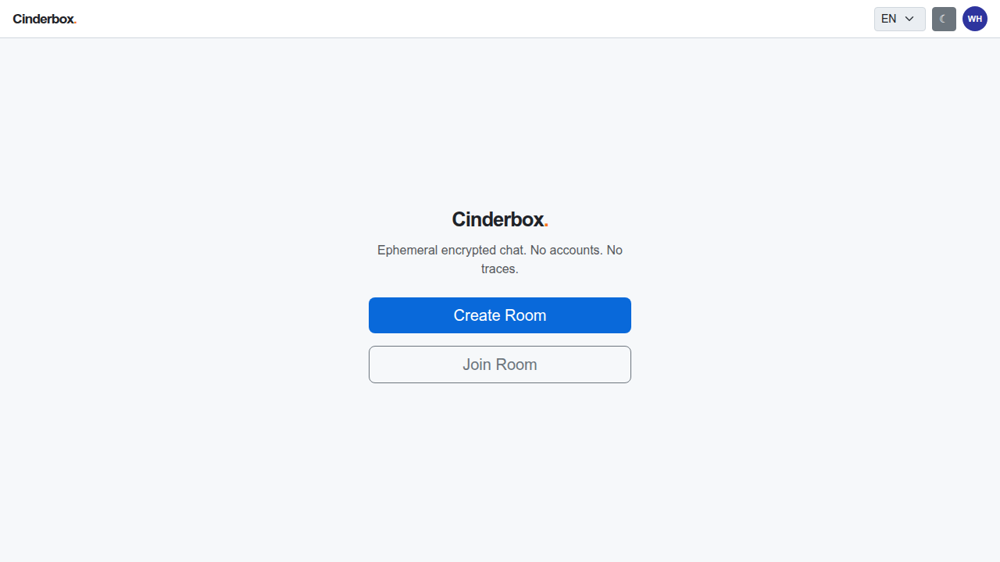

# Test Case 005 — Message Deletion

**Date:** 2026-03-19  
**Status:** ✅ Pass  
**Browser:** chromium

---

## Step 1: [User A] Load the application and create a room

User A creates a room and arrives at the chat screen.

**Status:** ✅ Success

---

## Step 2: [User B] Join the room and toggle the theme

User B joins the room with the shared password and toggles the UI theme. Each participant's theme preference is stored independently in their own localStorage.

**Status:** ✅ Success

---

## Step 3: [User A] Observe the join notification

User A detects User B's arrival from the server presence list. A system notice is generated locally.

**Status:** ✅ Success

---

## Step 4: [User A] Send a message

User A sends a message. It is encrypted client-side and stored on the server as ciphertext only.

**Status:** ✅ Success

---

## Step 5: [User B] Receive the message

After a sync cycle, User B receives and decrypts the message. It appears in the chat thread.

**Status:** ✅ Success

---

## Step 6: [User A] Open the context menu on the message

User A right-clicks the message to open the context menu. For outgoing messages, the menu offers "Message data", "Delete for everyone", and "Delete for me".

**Status:** ✅ Success

---

## Step 7: [User A] Delete the message for everyone

User A selects "Delete for everyone". The message content is immediately wiped locally and replaced with a tombstone. An ask_for_delete message is sent to each recipient.

**Status:** ✅ Success

---

## Step 8: [User B] See the message disappear from the chat

After a sync cycle, User B's client processes the ask_for_delete message and permanently deletes the message from local storage. Unlike the sender (who sees a tombstone), the recipient's message simply disappears. An ack_deleted acknowledgement is sent back to User A.

**Status:** ✅ Success

---

## Step 9: [User A] Delete the room

User A deletes the room. All remaining data is permanently removed from the server.

**Status:** ✅ Success

---

## Step 10: [User A] App returns to the landing screen

The app returns to the landing screen.

**Status:** ✅ Success

---

## Step 11: [User B] Room deletion detected — device data purged

On the next sync cycle after deletion, the server returns not_found for the room. User B's client calls purgeRoomLocally(): all messages and outbox items are deleted from IndexedDB, the room is removed from localStorage, and the app navigates to the landing screen. No residual data remains on the device.

**Status:** ✅ Success

---
