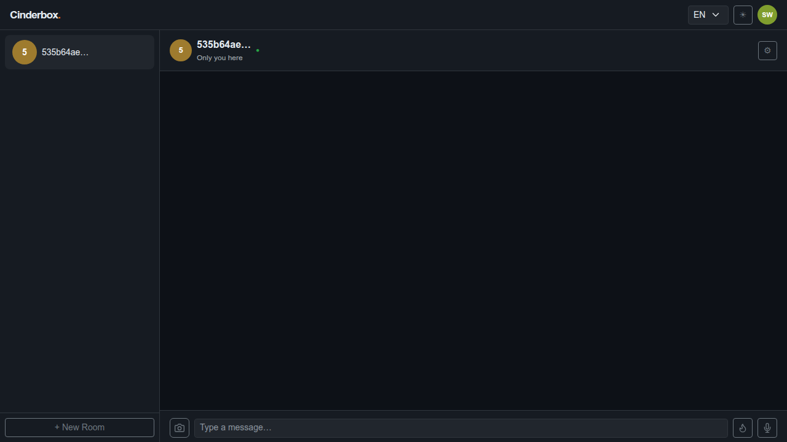
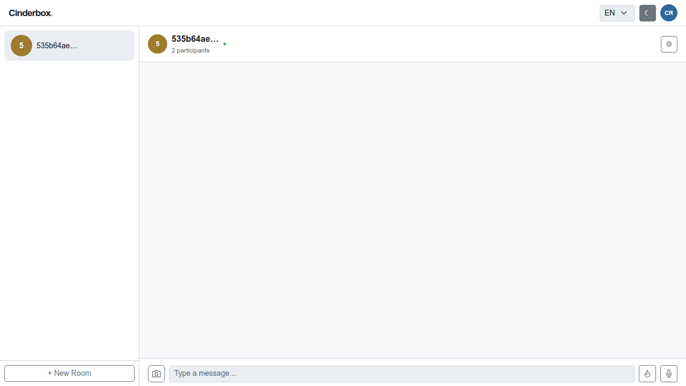
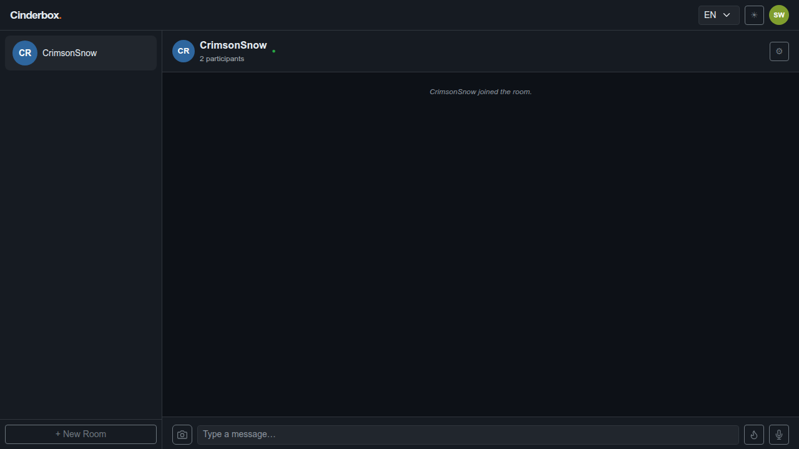
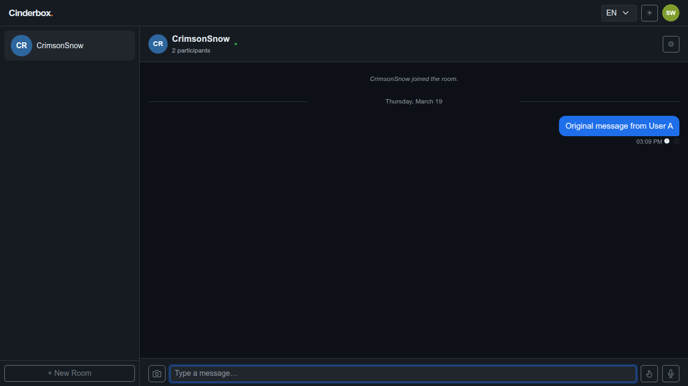
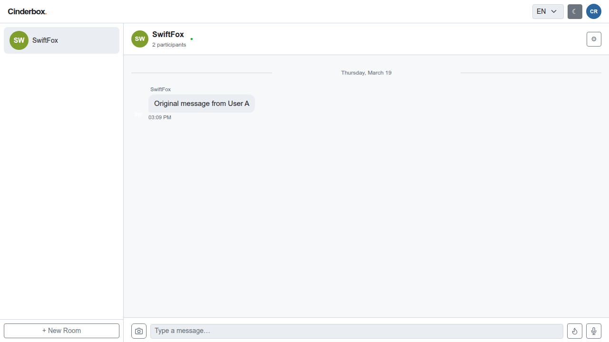
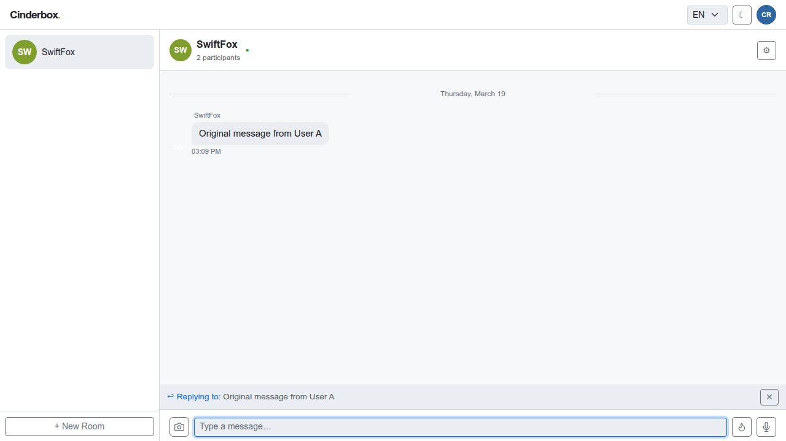
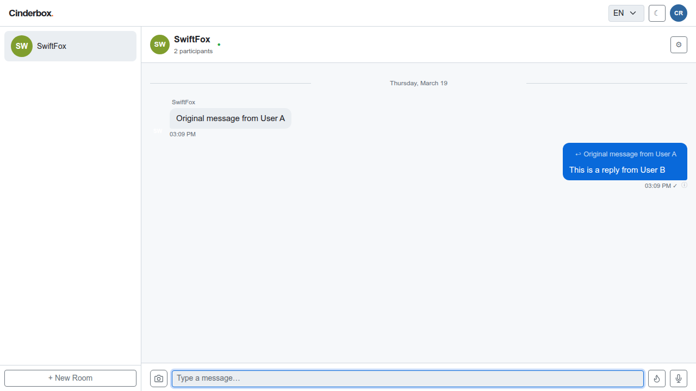
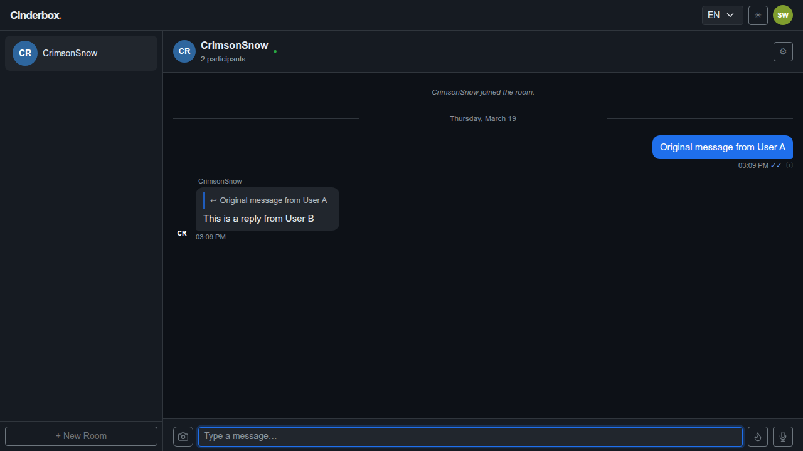
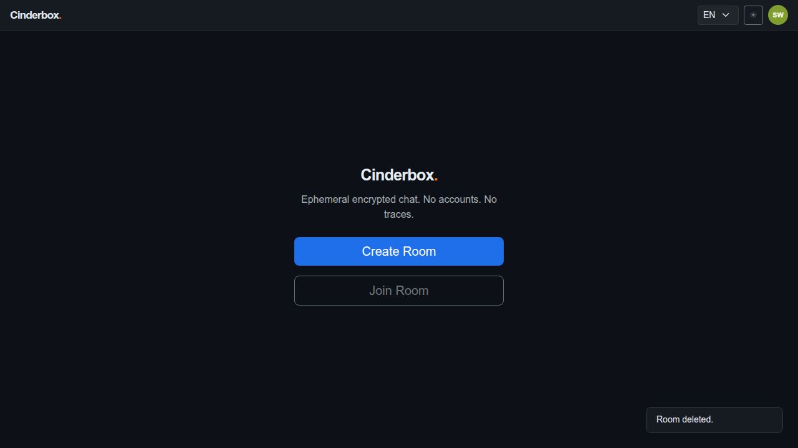
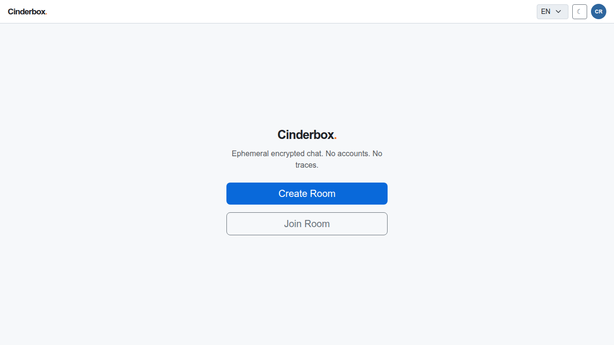

# Test Case 006 — Message Reply

**Date:** 2026-03-19  
**Status:** ✅ Pass  
**Browser:** chromium

---

## Step 1: [User A] Load the application and create a room

User A creates a room and arrives at the chat screen.

**Status:** ✅ Success

---

## Step 2: [User B] Join the room and toggle the theme

User B joins the room with the shared password and toggles the UI theme. Each participant's theme preference is stored independently in their own localStorage.

**Status:** ✅ Success

---

## Step 3: [User A] Observe the join notification

User A detects User B's arrival from the server presence list and sees a system notice.

**Status:** ✅ Success

---

## Step 4: [User A] Send the original message

User A sends a message that User B will reply to. It is encrypted and transmitted to the server.

**Status:** ✅ Success

---

## Step 5: [User B] Receive the original message

After a sync cycle, User B receives and decrypts the original message. It appears in the chat thread.

**Status:** ✅ Success

---

## Step 6: [User B] Open the context menu and select Reply

User B right-clicks the incoming message to open the context menu. For incoming messages, the menu offers "Reply" and "Delete for me". Clicking Reply shows a reply bar above the input with a preview of the original message.

**Status:** ✅ Success

---

## Step 7: [User B] Type and send the reply

User B types the reply and sends it. The message is sent with a reference to the original message ID. The reply bar clears automatically after sending.

**Status:** ✅ Success

---

## Step 8: [User A] Receive the reply with the quoted snippet

After a sync cycle, User A receives User B's reply. A quoted snippet of the original message is displayed inline above the reply text. Clicking the quote scrolls to the original message in the thread.

**Status:** ✅ Success

---

## Step 9: [User A] Delete the room

User A deletes the room. All messages are permanently removed from the server.

**Status:** ✅ Success

---

## Step 10: [User A] App returns to the landing screen

The app returns to the landing screen.

**Status:** ✅ Success

---

## Step 11: [User B] Room deletion detected — device data purged

On the next sync cycle after deletion, the server returns not_found for the room. User B's client calls purgeRoomLocally(): all messages and outbox items are deleted from IndexedDB, the room is removed from localStorage, and the app navigates to the landing screen. No residual data remains on the device.

**Status:** ✅ Success

---
