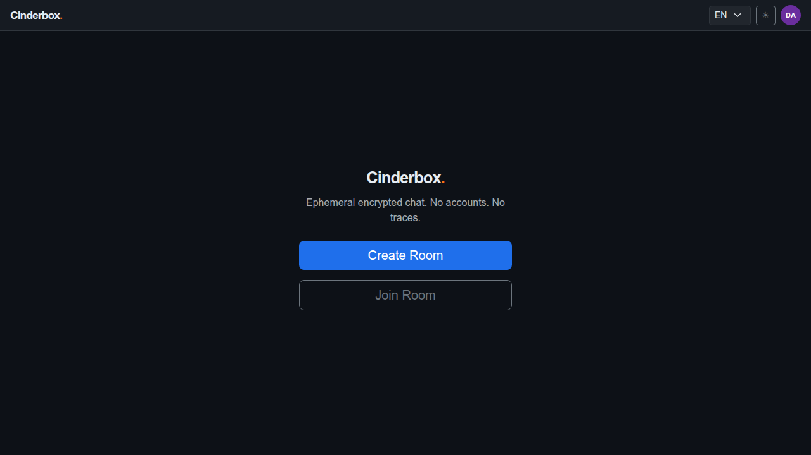
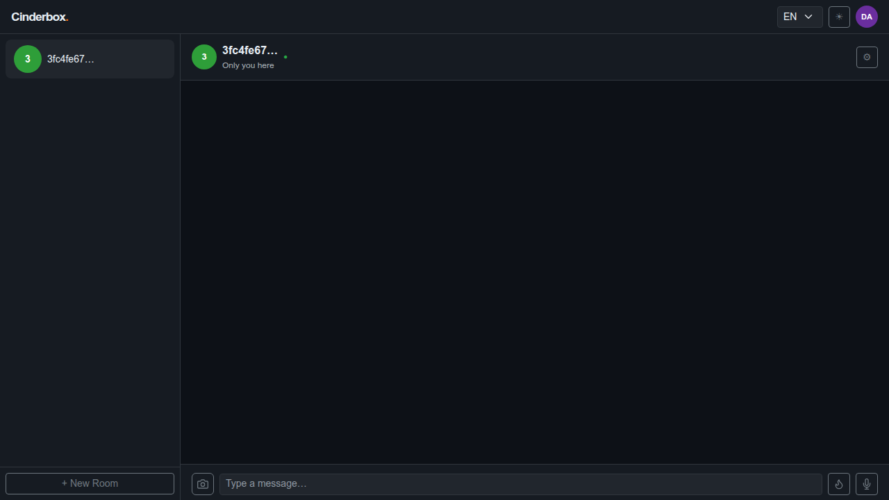
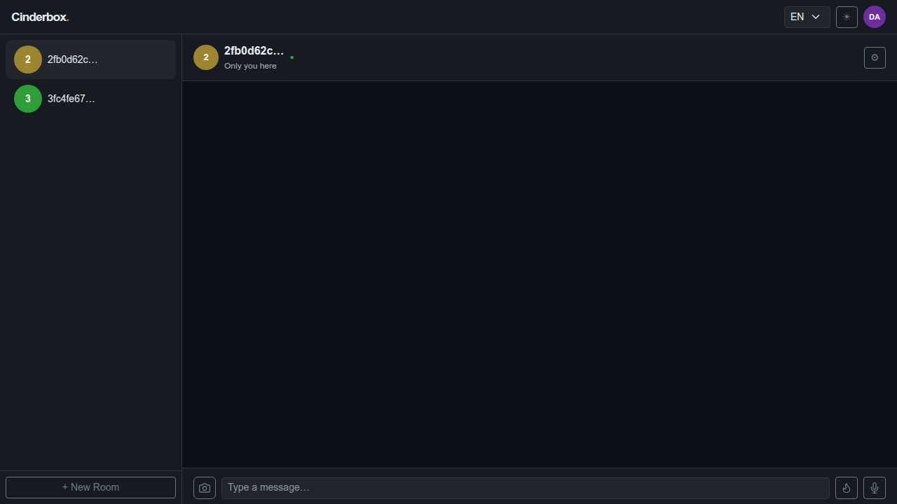
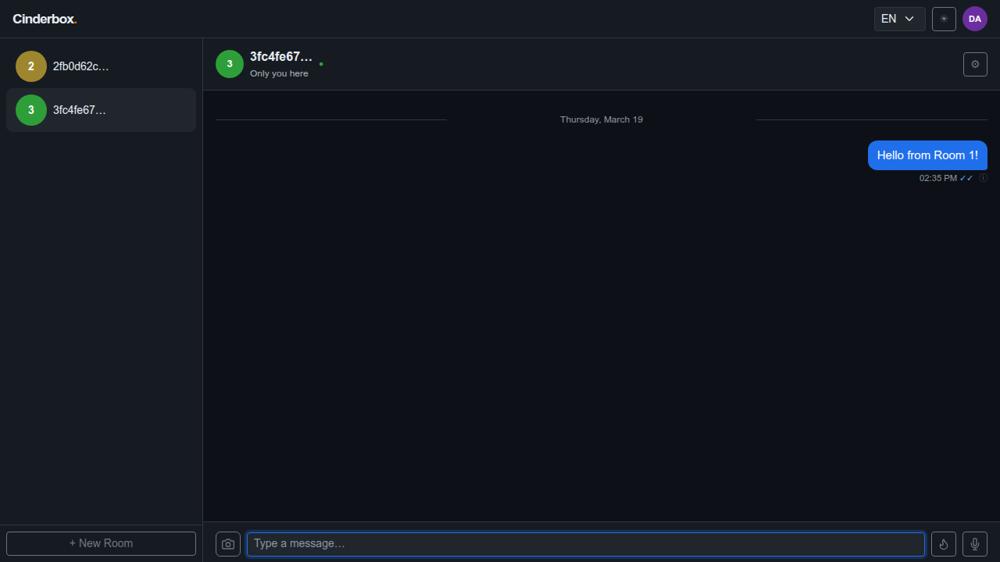
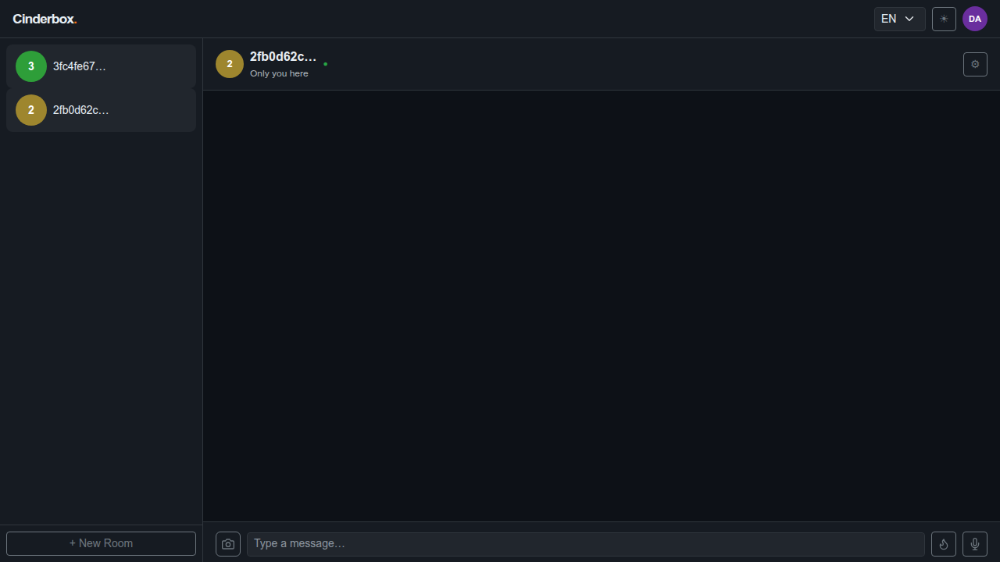
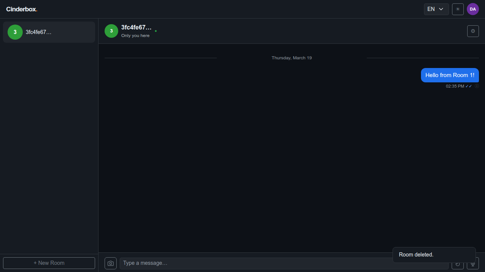
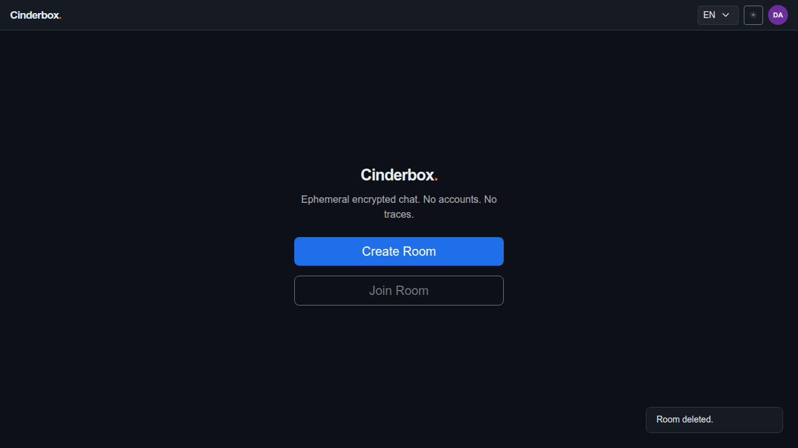

# Test Case 007 — Multiple Rooms

**Date:** 2026-03-19  
**Status:** ✅ Pass  
**Browser:** chromium

---

## Step 1: Load the application

The landing screen is displayed. No rooms exist yet.

**Status:** ✅ Success

---

## Step 2: Create Room 1

Room 1 is created with its own password and encryption key. The chat screen opens and the room ID is captured from the URL hash.

**Status:** ✅ Success

---

## Step 3: Create Room 2 using the sidebar button

The "+ New Room" button in the sidebar navigates back to the landing screen. From there, Room 2 is created with a different password and a completely independent encryption key.

**Status:** ✅ Success

---

## Step 4: Verify the sidebar shows both rooms

The sidebar lists both rooms. Each room has its own isolated message thread, password, and encryption key. Switching rooms changes the active context entirely.

**Status:** ✅ Success

---

## Step 5: Switch to Room 1 and send a message

Clicking Room 1 in the sidebar switches the active context. A message is sent and encrypted with Room 1's key. The URL hash updates to Room 1's ID.

**Status:** ✅ Success

---

## Step 6: Switch to Room 2 and verify message isolation

Switching to Room 2 shows an empty chat thread. The message sent in Room 1 does not appear here — rooms are fully isolated. The URL hash updates to Room 2's ID.

**Status:** ✅ Success

---

## Step 7: Delete Room 2

Room 2 is deleted. Since Room 1 still exists, the app switches to Room 1 automatically.

**Status:** ✅ Success

---

## Step 8: App switches to Room 1 after deleting Room 2

After deleting Room 2, the app automatically switches to the remaining room (Room 1). The previously sent message is still present, confirming room isolation was maintained throughout.

**Status:** ✅ Success

---

## Step 9: Delete Room 1

Room 1 is deleted. No rooms remain.

**Status:** ✅ Success

---

## Step 10: App returns to the landing screen

With no rooms remaining, the app returns to the landing screen. The multiple-rooms workflow is complete.

**Status:** ✅ Success

---
