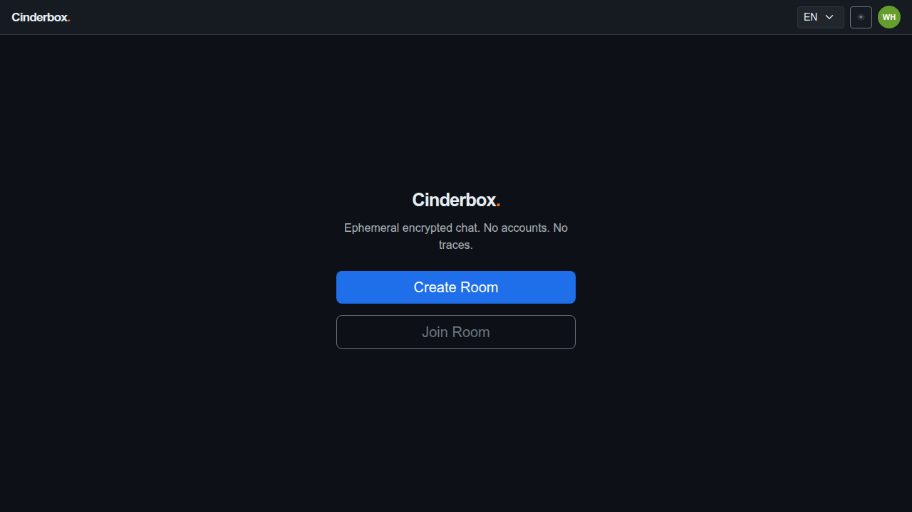
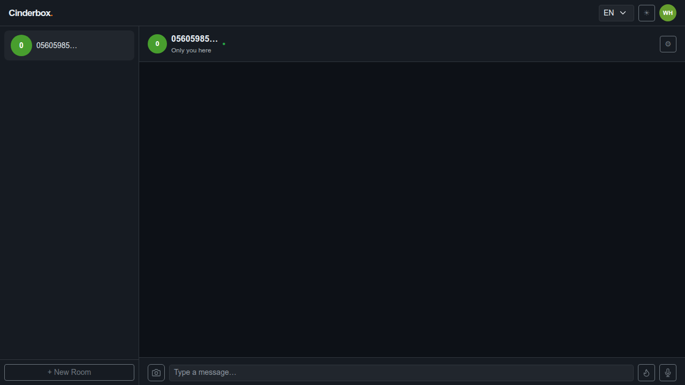
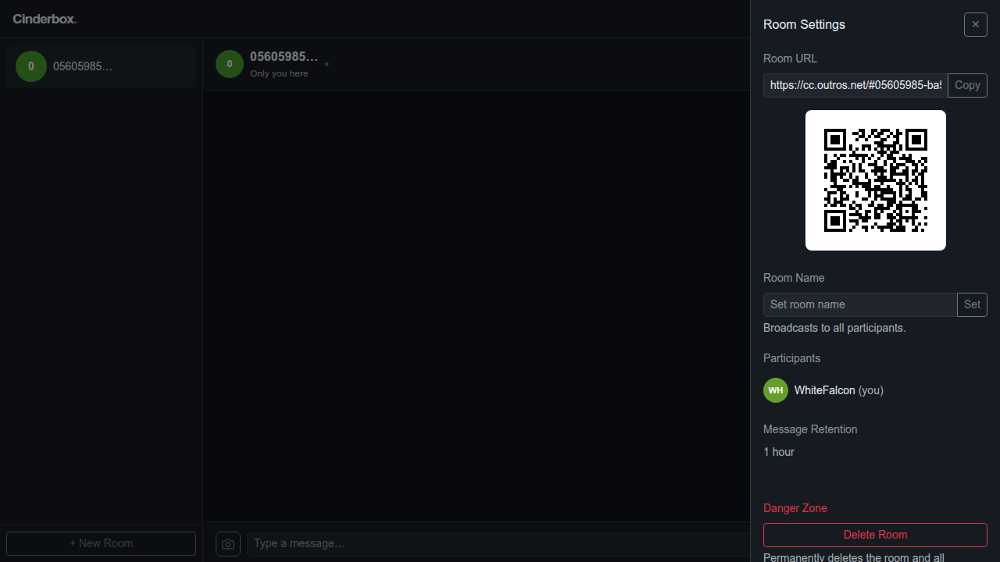
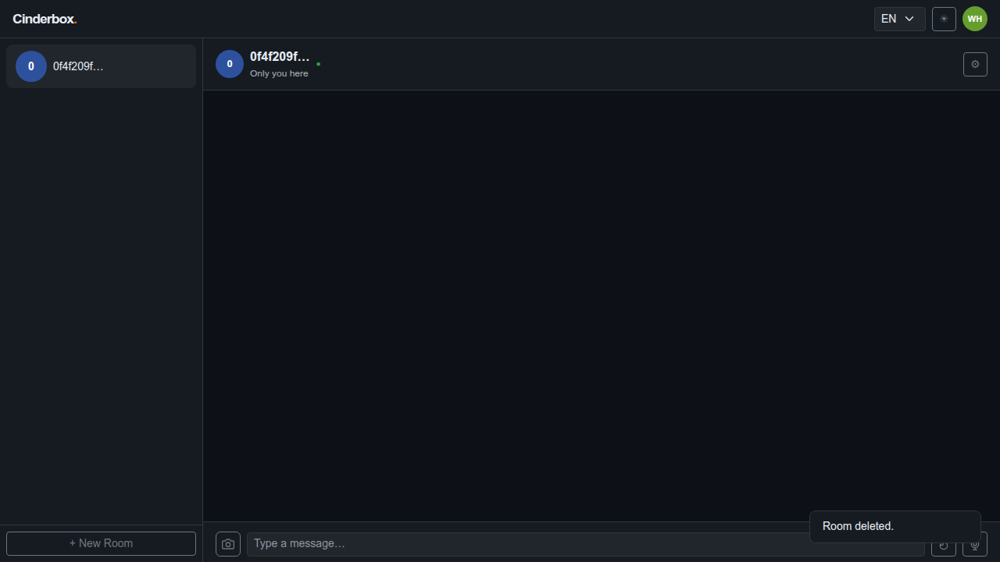
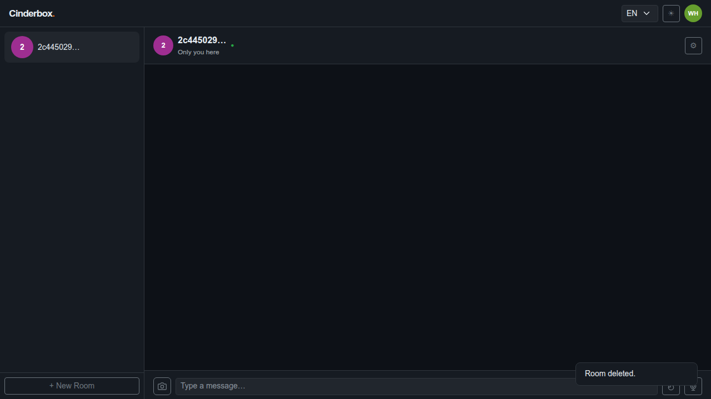
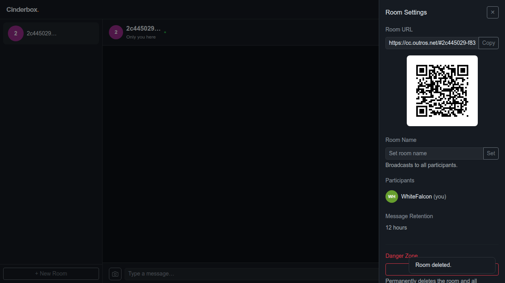
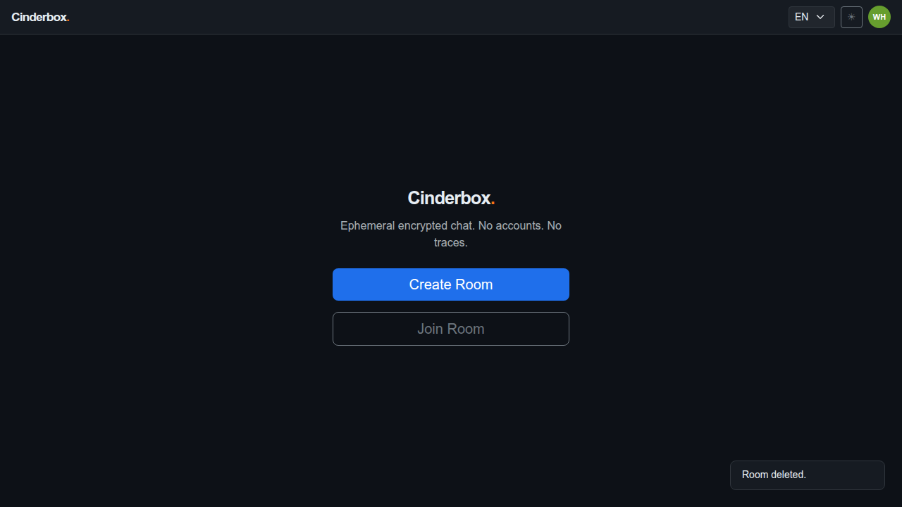

# Test Case 008 — Room Retention Policy

**Date:** 2026-03-19  
**Status:** ✅ Pass  
**Browser:** chromium

---

## Step 1: Load the application

The landing screen is displayed.

**Status:** ✅ Success

---

## Step 2: Create a room with 1-hour retention

A room is created with the 1-hour retention policy (value 0). The retention setting is stored locally and sent to the server at creation time. Messages in this room are automatically purged after 1 hour.

**Status:** ✅ Success

---

## Step 3: Open settings and verify 1-hour retention is shown

The settings panel shows the retention policy for the current room. "1 hour" confirms the correct policy was applied at creation.

**Status:** ✅ Success

---

## Step 4: Delete the 1-hour room

The room is deleted and the app returns to the landing screen.

**Status:** ✅ Success

---

## Step 5: Create a room with permanent retention

A room is created with the Permanent retention policy (value 5). Messages in permanent rooms are never expired by the server's lazy-expiry routine. The room is only removed by explicit owner deletion or 7-day abandonment.

**Status:** ✅ Success

---

## Step 6: Open settings and verify permanent retention is shown

The settings panel shows "Permanent" as the retention policy, confirming the correct value was stored and rendered.

**Status:** ✅ Success

---

## Step 7: Create a room with 12-hour retention

A third room is created with the 12-hour retention policy (value 3), covering one of the remaining retention options.

**Status:** ✅ Success

---

## Step 8: Open settings and verify 12-hour retention is shown

The settings panel confirms "12 hours" retention. All five retention options — 1h, 6h, 12h, 24h, and Permanent — map to specific server-side expiry behaviour.

**Status:** ✅ Success

---

## Step 9: Delete the room and return to landing

The final room is deleted. The app returns to the landing screen. The retention policy workflow is complete.

**Status:** ✅ Success

---
