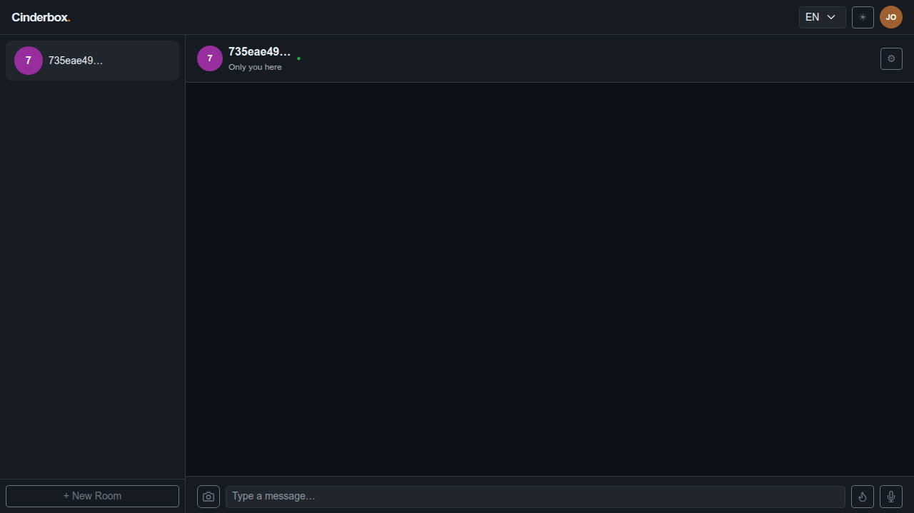
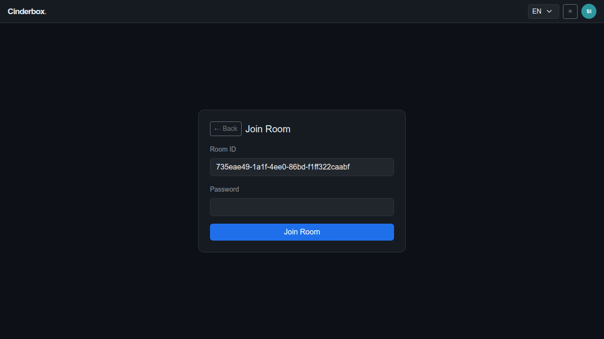
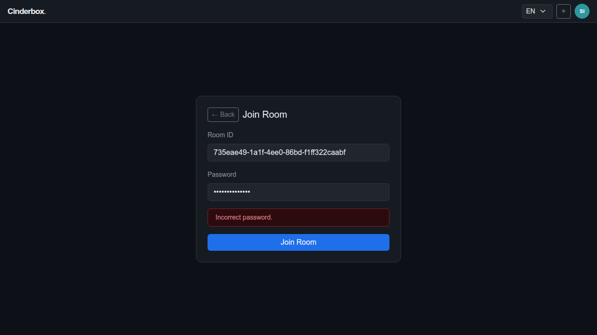
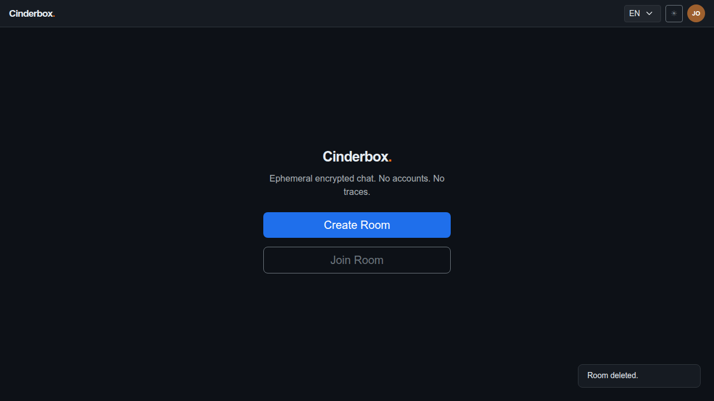

# Test Case 009 — Join with Wrong Password

**Date:** 2026-03-19  
**Status:** ✅ Pass  
**Browser:** chromium

---

## Step 1: [User A] Create a room

User A creates a room with a known password. The room URL will be shared with User B.

**Status:** ✅ Success

---

## Step 2: [User B] Navigate to the room URL

User B opens the room URL. The join screen is displayed with the room ID pre-filled.

**Status:** ✅ Success

---

## Step 3: [User B] Attempt to join with the wrong password

User B submits an incorrect password. The client fetches the room's encryption_test value, derives a key from the wrong password, and attempts to decrypt. Decryption fails — the error is caught entirely client-side before any room data is saved locally.

**Status:** ✅ Success

---

## Step 4: [User B] Verify the error message and join screen remains

"Incorrect password." is displayed in a red alert below the form. The join screen remains active — User B has not been granted access. No room data has been stored on User B's device.

**Status:** ✅ Success

---

## Step 5: [User A] Delete the room

User A deletes the room. The wrong-password test is complete.

**Status:** ✅ Success

---
