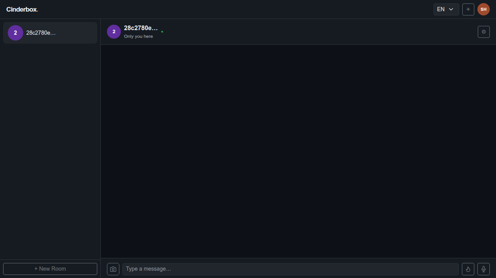
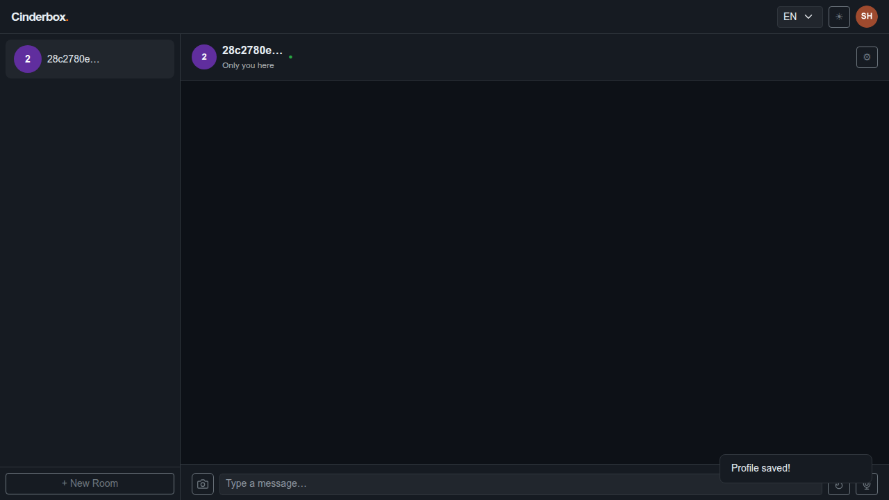
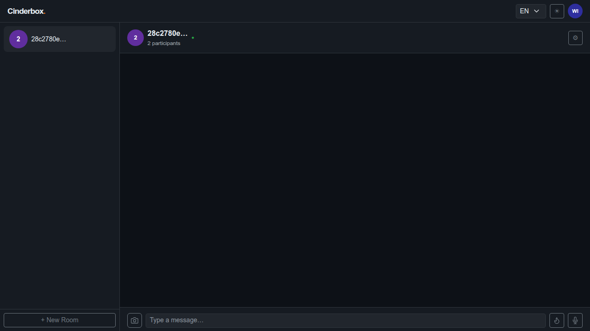
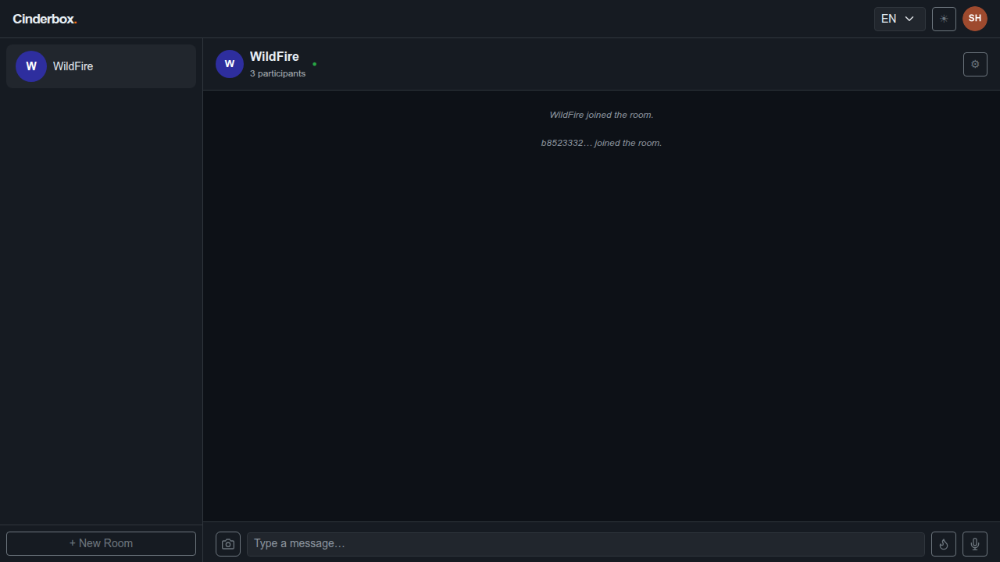
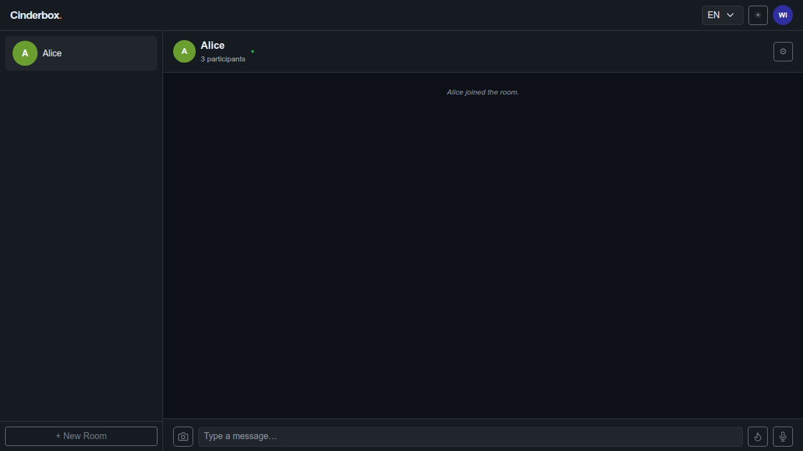
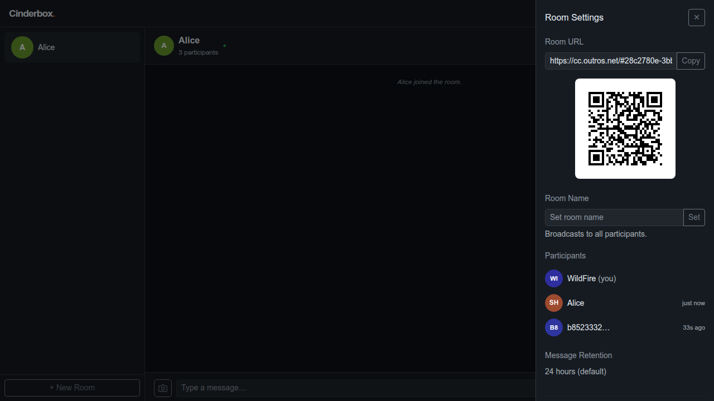
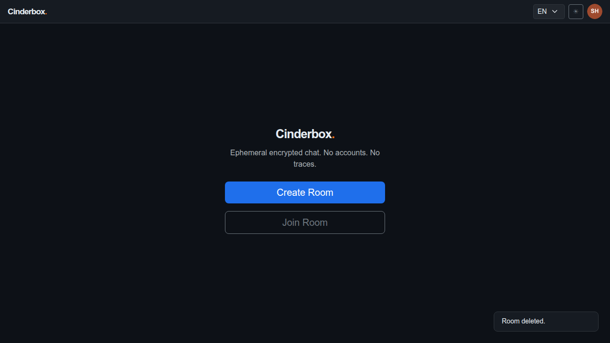

# Test Case 010 — Profile Propagation

**Date:** 2026-03-19  
**Status:** ✅ Pass  
**Browser:** chromium

---

## Step 1: [User A] Create a room

User A creates a room to get to the chat screen where the profile can be set.

**Status:** ✅ Success

---

## Step 2: [User A] Set the profile handle to "Alice"

User A opens the profile screen from the avatar button and sets the handle to "Alice". The handle is stored in localStorage. When another participant joins, a profile_update message will be broadcast carrying this handle.

**Status:** ✅ Success

---

## Step 3: [User B] Join the room

User B joins the room. On the next sync, User A's client will detect User B's presence and broadcast a profile_update message containing the handle "Alice".

**Status:** ✅ Success

---

## Step 4: [User A] Detect the join and broadcast profile

User A's sync detects User B in the presence list. A profile_update message is automatically broadcast to all participants, carrying User A's handle "Alice" and avatar. User B will receive this on the next sync.

**Status:** ✅ Success

---

## Step 5: [User B] Receive User A's profile

After a sync cycle, User B's client receives and stores the profile_update from User A. The handle "Alice" is now associated with User A's sender tag in User B's local profile store.

**Status:** ✅ Success

---

## Step 6: [User B] Open settings and see "Alice" in the participants list

The settings panel's participants list shows "Alice" — confirming that User B has received and applied User A's profile_update. Profiles are never stored on the server; they travel as encrypted messages like any other content.

**Status:** ✅ Success

---

## Step 7: [User A] Delete the room

User A deletes the room. The profile propagation workflow is complete.

**Status:** ✅ Success

---
