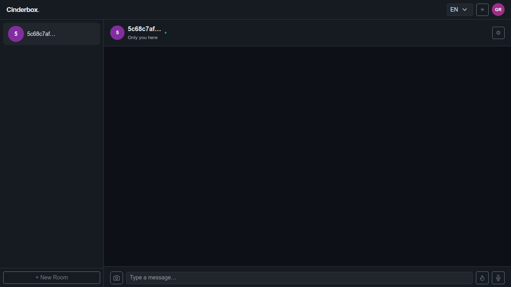
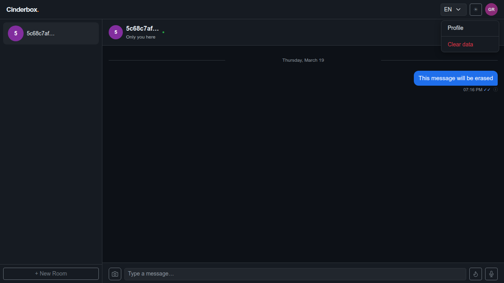
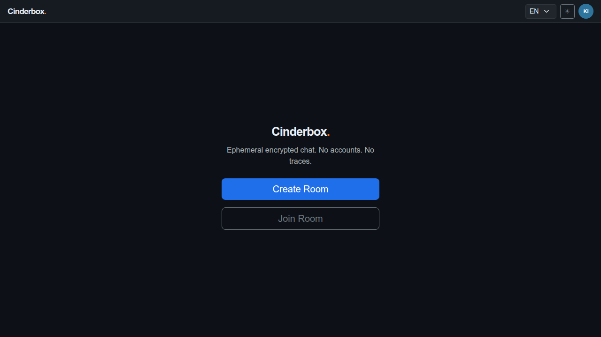

# Test Case 011 — Clear Data

**Date:** 2026-03-19  
**Status:** ✅ Pass  
**Browser:** chromium

---

## Step 1: Load the application and create a room

User creates a room and arrives at the chat screen. The room is stored in localStorage and its messages are stored in IndexedDB.

**Status:** ✅ Success

---

## Step 2: Send a message

A message is sent and synced to the server. It is stored in IndexedDB on the device and visible in the chat thread.

**Status:** ✅ Success

---

## Step 3: Verify the message appears in the chat

The message is visible in the chat thread, confirming it is stored locally in IndexedDB.

**Status:** ✅ Success

---

## Step 4: Open the nav menu

The navigation menu opens, exposing the "Clear data" option alongside the Profile link.

**Status:** ✅ Success

---

## Step 5: Click "Clear data" and confirm the dialog

The user confirms the destructive action in the native confirm dialog. The app sends leave_room notifications for non-owner rooms, deletes owner rooms via the API, wipes all IndexedDB stores (messages and outbox), and clears localStorage before reloading.

**Status:** ✅ Success

---

## Step 6: App returns to the landing screen with no rooms

After the reload, the app starts fresh on the landing screen. The cc_rooms key is gone from localStorage, confirming all room data has been erased from the device. The server room was also deleted via the API since the user was the owner.

**Status:** ✅ Success

---
